Title         	: <h1>Monetary Reform</h1> 

Subtitle      	: A better monetary system for Iceland 

Title Note    	: _Comissioned by the prime minister of Iceland_

Logo          	: true

Author        	: By Frosti Sigurjonsson

Toc Depth 		  : 2

CSS Header      : body{position:relative;color:#323232} .sidenote {font-size:0.8em;} 

CSS Header      : @media (min-width:135ex){ .sidenote{position:absolute; right:-32ex; width: 32ex;} .sidenote p { text-align:left;}}

JS Footer:     : function offsetAnchor() {if(location.hash.length)window.scrollTo(window.scrollX, window.scrollY - 30);};window.addEventListener("hashchange",offsetAnchor);window.setTimeout(offsetAnchor, 1);

CSS Header      : a {text-decoration: none;border-bottom: 2px rgba(255, 247, 45, 0.82) solid;color: #323232;} a:hover {  	background-color: rgba(255, 247, 45, 0.82);  	border-top: 1px rgba(255, 247, 45, 0.82) solid;  } .tocitem a, .tocitem a:hover{border:0;background-color:rgba(255,255,255,0);} 

[TITLE]

[TOC]

_This website version of "[Monetary Reform - A Better Monetary System For Iceland (2015)](https://www.forsaetisraduneyti.is/media/Skyrslur/monetary-reform.pdf)"" was created to make it easy to discuss and link to speficic parts of the documents. Pleaes edit on [github](http://github.com/mathiasrw/monetary-reform ) if you find any errors in the footnotes, layout or text._ 

----

# Foreword by Adair Turner { - }

In the aftermath of the 2008 financial crisis, financial regulators and
central banks across the world have put great efforts into making the
existing financial system more stable, increasing bank capital and
liquidity requirements, developing bank resolution plans, and requiring
derivatives trading to go through central clearing houses. Those
efforts, in which I was deeply involved from 2008 to 2013, have been
valuable, reducing the probability of another financial crisis in the
short term.

But they have still failed to address the fundamental issue - the
ability of banks to create credit, money and purchasing power, and the
instability which inevitably follows. As a result, the reforms agreed to
date still leave the world dangerously vulnerable to future financial
and economic instability.

This report addresses those fundamental issues. It is rightly title 
"Monetary Reform" because it goes beyond the technical details of bank
regulation to question who should create money and how we ensure that
new money is devoted to useful ends.

It does a crucial job of public education, explaining how "fractional
reserve" banks create money, and why excessive levels of private debt
will inevitably result in crisis. And it explains why financial and
economic instability cannot be effectively managed using only the
interest rate policy tool on which central banks have traditionally
relied.

It proposes a radical structural solution to the problems we face. The
feasibility and merits of that specific solution need to be debated. But
whatever the precise policies pursued, they must be grounded in the
philosophy which this report proposes - that money creation is too
important to be left to bankers alone.

> Adair Turner was chairman of the UK Financial Services Authority from
September 2008 to March 2013, and was chair of the policy development
committee of the international Financial Stability Board from 2009-2013.
His book on the crisis -Between Debt and the Devil: Money, Credit and
Fixing Global Finance will be published in September 2015 by Princeton
University press.

----

# Preface { - } 

> "Of all the many ways of organising banking, the worst is the one we
have today. ... Change is, I believe, inevitable. The question is only
whether we can think our way through to a better outcome before the next
generation is damaged by a future and bigger crisis. This crisis has
already left a legacy of debt to the next generation. We must not leave
them the legacy of a fragile banking system too." -Lord Mervyn King,
Governor of the Bank of England 2003-2013 ^1^

This report, commissioned by the Prime Minister of Iceland, presents the
results of a study into the money creation mechanism in Iceland and the
potential for its improvement.

For more than half a century, Iceland has suffered from serious monetary
problems including inflation, hyperinflation, devaluations, an asset
bubble and ultimately the collapse of its banking sector in 2008. Other
countries have faced similar problems. Since 1970, bank crisis have
occurred 147 times in 114 countries ^2^ causing serious reductions in
output and increases in debt.

Despite its frequent failures, the banking system has remained
essentially unchanged and homogenous around the world. Various reform
proposals have been put forward, many of them promising, but none have
been implemented.

A necessary step toward monetary reform is to increase awareness of the
drawbacks and risks of the present system and why reform is needed. This
report will hopefully serve as a useful source of information for the
coming debate on the money creation process in Iceland and how it could
be reformed to serve society better in the future.

_Reykjavik, March 20th 2015_ 

Frosti Sigurjonsson

~ sidenote
^1^ _Mervyn King, (2010)_

^2^ _Leaven L. & Valencia, (2012)_
~

----

# 1 Overview and summary { - }

## 1.1 Abstract { - }

This report is a study of monetary problems in Iceland and in what part
they may be caused by the current monetary mechanism, the fractional
reserve system.

There is indication that the fractional reserve system may have limited
the Central Bank's ability to control the money supply while giving
banks both the power and incentive to create too much money. Indeed,
commercial banks expanded the money supply nineteen-fold in the fourteen
year period that ended with the banking crisis of 2008.

There is also indication that the fractional reserve system may have
been a long term contributing factor to various monetary problems in
Iceland, including: hyperinflation in the 1980s, chronic inflation,
devaluations of the Icelandic Krona (ISK), high interest rates, the
government foregoes income from money creation, and growing debt of
private and public sectors.

Economists have long been aware of the problematic nature of the
fractional reserve system and proposed various reforms. A program for
monetary reform by Fisher et al in 1939 received the support of 235
economists from 157 universities and colleges but was not implemented.
This report reviews some of the more frequently mentioned proposals for
monetary reform: 100% Reserves, Narrow Banking, Limited Purpose Banking
and describes in detail the Sovereign Money proposal.

In a Sovereign Money system, only the central bank, owned by the state,
may create money as coin, notes or electronic money. Commercial banks
would be prevented from creating money.

This report describes how such a Sovereign Money system could be
implemented and what steps would be required for a successful
transition.

## 1.2 The need for monetary reform { - }

There is evidence that the fractional reserve system itself may have
been a contributing factor to various monetary problems in Iceland
including:

### 1.2.1 The Central Bank of Iceland is not in control of the money supply { - }

Commercial banks create money when they make loans and delete money when
loans are repaid. The Central Bank of Iceland must provide banks with
reserves (money in accounts at the CBI) as needed, in order not to lose
control of interest rates or even trigger a liquidity crisis between
banks. The Central Bank of Iceland therefore had to create and provide
new central bank reserves to accommodate banks as they expanded the
money supply nineteen fold between 1994 and 2008.

### 1.2.2 Commercial bank lending tends to amplify the economic cycle { - }

When the economic outlook is positive, banks acting to maximise profit
will lend more (so the money supply grows at a faster rate) but when the
economy is doing badly, banks' lending slows down (so the money supply
grows at a slower rate, or even starts to contract). This lending
behaviour amplifies the economic cycle.

In the expansionary years of 2003 to 2006, the Central Bank of Iceland
raised the policy rate (the base rate of interest) and warned that the
economy was overheating. However, this did not prevent the banks from
over expanding the money supply.

### 1.2.3 Banks' expansion of the money supply has led to inflation and devaluations of the ISK { - }

For decades, commercial banks in Iceland have expanded the money supply
much faster than was required to support economic growth in Iceland. In
the twenty years from 1986 to 2006, GDP grew on average by 3.2% per
annum. In the same period banks expanded the money supply by an average
of 18.6% per annum.

Expanding the supply of ISK _six times_ faster than was needed for
economic growth was a leading cause of inflation and devaluation of the
ISK. In an effort to curb lending, the Central Bank of Iceland increased
its policy rates from 5.6% in 2004 to 18.0% in 2008. Raising the policy
rate was largely ineffective in restricting money creation by the banks,
and also had the unwanted side effect of creating a surge in demand for
ISK by foreign investors. This demand served to delay the inevitable
devaluation of the ISK. In 2008 reality caught up with the ISK and the
exchange rate fell by 50% against the USD.

### 1.2.4 The state foregoes considerable income by delegating money creation to the banks { - }

By delegating the creation of money to private commercial banks, the
Central Bank of Iceland, and thereby the state, foregoes considerable
income that it would otherwise earn from creating new money to
accommodate economic growth.

Commercial banks in Iceland reap a benefit from the ability to create
money in the form of demand deposits. Banks can pay lower interest on
demand deposits than they would by borrowing in the market. Owners of
demand deposits are content with low interest rates because the deposits
are a convenient form of money and for banks that are 'too big to fail',
there is an inevitable state guarantee on deposits. Unless banks are
engaged in 'perfect competition' (a situation that almost never arises
outside of economic textbooks), much of this cost-advantage ends up as
extra profit for the banks.

It can be estimated that by delegating the bulk of money creation in the
economy to private banks, the Central Bank of Iceland foregoes estimated
annual revenue of close to ISK 20 bn. ^3^

~ sidenote
^3^ _See section [7.1.5](#7-1-5)_  
~ 

### 1.2.5 The government is forced to guarantee bank deposits { - }

Although demand deposits are a convenient form of money from the
perspective of businesses and members of the public, fundamentally they
are simply a liability (or IOU) of the issuing bank. A demand deposit
represents a bank's commitment to pay the deposit amount in cash, or to
electronically transfer it to another beneficiary, when the owner so
demands.

A bank's stock of cash and Central Bank reserves (both assets of the
bank) is small compared to total deposits (the banks' liability). A
rumour that a bank may be in difficulty can therefore cause customers to
withdraw their deposits in panic (a bank run). A bank run forces the
bank to sell assets quickly to fund payouts to depositors. Such a sudden
increase in the supply of assets can lead to a fall in market prices,
putting other banks into trouble, and the whole banking system may
follow. Faced with the possibility of such a scenario, governments
prefer to issue a state guarantee on deposits, promising to repay
depositors if the bank is unable to do so. The hope is that this
guarantee will calm depositors and halt bank runs.

Faced with a bank run in 2008, the government of Iceland declared that
the domestic deposits in the local banks were fully guaranteed. By 2015
this declaration has not been formally revoked. However, it
makes little difference whether the government explicitly provides a
guarantee on deposits: when faced with a run on a major bank, the
government would in all cases be forced to issue or reaffirm a state
guarantee on deposits to avert a full-blown crisis.

As long as the bulk of the money supply is in fact deposits (liabilities
of commercial banks), backed by risk-bearing assets, the state will have
no option but to guarantee these deposits to avert crises.

### 1.2.6 The implied state guarantee on deposits encourages risky lending { - }

Because savers can expect that the state will step in and guarantee
their deposits, the deposits of all banks become 'risk-free' to savers.
Savers will therefore deposit their money with the bank that offers the
highest rate with little consideration of the risk taken by the bank.
Bank managers must therefore compete for customers, based mostly on
interest rates, but not on how solid the bank is. The implied state
guarantee therefore encourages risky lending, which in turn increases
the risk of more bank failures and crisis.

Landsbankinn began offering online savings accounts in the UK in 2006
offering some of the highest deposit interest rates in the UK. When the
bank collapsed in 2008, it had attracted 300 thousand customers and
deposits of GBP 4 billion.

### 1.2.7 A state guarantee on deposits gives unfair competitive advantage { - }

Commercial banks that are able to create money at will, have an unfair
competitive advantage against investment banks and other financial
firms. A commercial bank has access to cheap funding in the form of
state guaranteed deposits with low rates, while an investment bank has
to borrow its funds at market rates, because its liabilities are not
explicitly or implicitly guaranteed by the government.

### 1.2.8 Deposit Insurance is ineffective if a large bank fails in Iceland { - }

Deposit Insurance may work as intended in a country with thousands of
participating banks, where risk can be distributed effectively. In
Iceland however, the three large banks share 90% of the market. Should
any one of them fail, the insurance fund will not suffice to bail out
all depositors. In such circumstances, the government will have to step
in with taxpayers' money to guarantee deposits.

Deposit Insurance creates an illusion of security that reduces savers'
incentives to consider whether the bank is taking dangerous risks
with its investments. Banks are thus motivated to compete less on trust
or the safety of its investments and more on high rates. To be able to
pay these higher rates the bank must take more risk, which makes banks
more likely to fail.

## 1.3 Alternatives to the fractional reserve system { - }

It is tempting to add yet more rules and regulation to the current
system hoping to reduce the risks. This has indeed been the approach to
date (Basel I was 30 pages, Basel II was 251 pages and now Basel III is
509 pages). But ever-more complicated regulation is costly for banks to
implement, difficult to monitor and does not remove the fundamental
flaws of the system. Rather than attempting to patch a system that has
consistently failed, it may be worth considering some alternatives.

Various alternatives have been proposed: 100% Reserves, Narrow Banking,
Limited Purpose Banking and Sovereign Money. Of these proposals, only
Sovereign Money transfers the power to create money to the state and
effectively separates the _creation power_ from the _allocation power_, and
provides a transition to debt free money. The Sovereign Money System is
described in detail in Chapter 7.

### 1.3.1 The Sovereign Money System { - }

The Sovereign Money System is based on proposals outlined in Modernising
Money (2013) by Dyson, Jackson, which in turn builds on Creating New
Money (2000) by Huber and Robertson and the work of Fischer in the
1930's.

In a Sovereign Money system, private banks do not create money. Instead
this power is in the hands of the Central Bank, which is tasked with
working in the interest of the economy and society as a whole. In the
Sovereign Money system, all money, whether physical or electronic, is
created by the Central Bank.

Although commercial banks will no longer create money, they will
continue to administer payments services for customers and will make
loans by acting as intermediaries between savers and borrowers.

The payments service will consist of Transaction Accounts held by
individuals and businesses. The funds in Transaction Accounts will be
electronic sovereign money created by the Central Bank. Transaction
Accounts are risk free, as they are kept at the Central Bank, and
interest-free as they are not available to the bank to invest.

The intermediary service will consist of Investment Accounts held by
individuals and businesses. Funds can be transferred from a Transaction
Account to an Investment Account. Funds in an Investment Account are
invested by the bank and not available to the owner before the due date,
or after a notice period has passed. The commitment period can range
from 45 days to a few years. Banks can offer Investment Accounts with
different risk profiles, maturity and interest rates, catering to
different types of savers.

The Central Bank will be exclusively responsible for creating the money
necessary to support economic growth. Instead of relying on interest
rates to influence money creation by banks, the Central Bank can change
the money supply directly. Decisions on money creation will be taken by
a committee that is independent of government and transparent in its
decision-making, as is the current monetary policy committee.

New money, created by the Central Bank, will be transferred to the
government and put into circulation in the economy via increased
government spending, by reduction in taxes, by repaying public debt or
by paying a citizen dividend.

The Central Bank will also be able to create money for lending to banks
for onward lending to businesses outside the financial sector.

### 1.3.2 Benefits of the Sovereign Money System { - }

In a Sovereign Money System the amount of money in the economy is
controlled directly by the Central Bank, preventing private banks from
expanding it.

The pro-cyclical expansion of the money supply by private banks will be
made impossible. Instead, the Central Bank will increase the money
supply in proportion with the overall growth of the economy and to meet
inflation targets.

Crucially, the power to create money is kept separate from the power to
decide how that new money is _used_, thereby ensuring that conflicts of
interest do not lead to too much (or too little) money being created, or
money being created for private, rather than public, benefit.

The risk of sudden bank runs is greatly reduced. Deposits on Investment
Accounts have maturities that are distributed over a longer period,
allowing banks time to liquidate assets if needed. Deposits in
Transaction Accounts are protected in a bank failure as they are kept at
the Central Bank, on behalf of the customers, and are separate from the
failing bank's own assets. A deposit guarantee scheme is therefore not
necessary for Transaction Accounts.

Income from creating the money supply accrues to the state owned Central
Bank, resulting in larger dividend to the state, and can be used for
democratically decided purposes. Based on annual GDP growth of 2%, an
inflation target of 2%, and an initial money stock of ISK 500 bn the
annual income from sovereign money creation could be close to ISK20bn.

In addition, the state will get a one-time income of 300-400 bn ISK over
a number of years during the transition to a Sovereign Money system.
This happens as the Central Bank creates sovereign money to replace the
old bank created money. The new sovereign money can be put into
circulation by the state via: the purchase of government bonds, increase
in government expenditure or reduction of taxes, by lending to banks, or
a blend of those methods.

By using a state created money supply, instead of effectively 'renting'
the money supply from private banks, the overall level of debt in the
economy will be reduced. Demand for loans will be reduced which puts
downward pressure on interest rates.

A Sovereign Money system dramatically reduces the risk involved in
commercial banking. This could open the way to some reduction in
regulatory burden in banking and reduction of overhead costs. It could
also reduce the need for separation of investment and commercial banks
thereby allowing for better economies of scale.

### 1.3.3 Transitioning to a Sovereign Money System { - }

From day one, banks will not be able to create money, but it may take a
number of years for the money they have created to be replaced with
sovereign created money. This allows for a smooth transition to the new
system and banks will have several years to adapt.

Upon transition, existing demand deposits are transferred from
commercial banks into Transaction Accounts held at the Central Bank of
Iceland (CBI). In return for assuming this liability on behalf of the
commercial banks, the CBI would receive a claim of equal value to the
deposits it takes over from each bank. These claims, termed the
Conversion Liability, would amount to a total of ISK 450 bn and the
banks would repay them to the CBI gradually over a number of years.

As commercial banks repay their Conversion Liability, the bank-created
money leaves the money supply. The CBI therefore creates new Sovereign
Money to compensate for this reduction. The bulk of this new money can
be put into circulation by reduction of public debt but other previously
mentioned means could also be considered in part. Public debt could
therefore be reduced by up to 450 bn ISK in the process of transitioning
from private commercial bank money to new
sovereign money. The CBI could also use the transition to reduce the
money supply if needed.

## 1.4 Recommendations { - }

Commercial banks in Iceland have created far more money than was needed
for economic growth. This caused severe monetary problems including;
inflation, currency depreciations, an asset bubble and a banking crisis.
Past attempts at preventing these problems have not given enough
attention to the money supply, the money creation process and how it
could be brought under control.

The present fractional reserve system is unstable and encourages risk
taking. Banks have an incentive to create money and central banks have
failed to constrain them. Without reform, the Central Bank must
proactively enforce credit controls; set limits to the growth rate of
bank lending and set limits to lending to the financial sector. Such
measures will not be popular with banks, but necessary since traditional
instruments have failed.

It would be preferable to remove the root-cause of the problems and
secure the money power with the state owned Central Bank. Furthermore,
the power to create money should be separated from the power to allocate
new money. This will effectively reduce the risk and instability of the
monetary system, debts will be substantially reduced and the income from
creating money will accrue to the state rather than banks.

Iceland, being a sovereign state with an independent currency, is free
to reform its monetary system from the present unstable fractional
reserves system and implement a much better monetary system. Such an
initiative must however rest on further study of alternatives and a
widespread consensus on the urgency for reform.

The debate on the money creation process in Iceland is just starting and
will need time to run its course. The findings in this report will
hopefully be part of that debate.

Meanwhile, the Sovereign Money Proposal seems to offer a very promising
basis for reform. It is therefore recommended that a feasibility study
of its potential implementation in Iceland will be conducted.

# 2 Monetary problems in Iceland { - }

It is fair to say that Iceland's monetary history has been a turbulent
one. Currency controls in the 1920s to the 1950s were followed by
chronic inflation in the 1970s to the 1980s, with annual inflation
reaching a high of 83% in 1983. In 1981 it was considered necessary to
redenominate the krona with 100 units being replaced by 1 new unit.

Inflation : Annual Changes in the Consumer Price Index

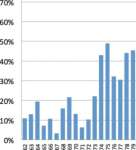

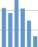

Fig 2.1. Source: Statistics Iceland

After the moderate 1990s came the booming 2000s that ended with a
dramatic crash in 2008. Banks collapsed and the value of the ISK dropped
by 50% in one year. Capital controls were introduced late 2008 and are
still in force six years later.

The Central Bank of Iceland was established in 1961 with the aim to
promote price stability. Five decades later, the ISK had lost 99.7% of
its purchasing power.

In the following chapters we shall take a closer look at these serious
monetary problems in an effort to determine what the main causal factors
were.

Iceland's economy is an open one. Exports accounted for 57% of GDP in
2013. Imported goods account for close to half of private consumption,
which means that the local price level is greatly affected by price
changes in imported goods.

Iceland's exports have over the past decades diversified from consisting
primarily of fish products to include aluminium, tourism and technology.
Continued diversification offers hope for improved monetary stability in
the future.

On the positive side, there is indication that many of Iceland's
monetary problems may have been the result of a flawed system and by
reforming the system, similar problems could be prevented from recurring
in the future.

In Iceland, as elsewhere, new money is created and injected into the
economy through the mechanism of fractional reserve banking. Critics
have argued that inherent flaws in the fractional reserve system
contribute to a range of monetary problems including; uncontrolled
expansion of the money supply, asset price bubbles (especially in
housing], and bank runs, growing debt and inequality, chronic
inflation, economic instability, and loss of seigniorage income for the
state.

We begin therefore by explaining the money creation mechanism in Iceland
before we look more closely at how it has performed.

# 3 The money creation mechanism { - }

A stable and adequate money supply is a fundamental requirement for a
well-functioning economy. Excessive expansions/contractions of the money
supply can lead to inflation/deflations of the price level as well as
booms/busts in economic activity.

Until recently, the process of money creation has been widely
misunderstood. Most economic textbooks explained money creation based on
the "money multiplier model", but as will be explained in Chapter 3.1
this is not what happens in reality.

According to the money multiplier model the Central Bank is in control
of the total money supply. By creating a certain amount of base money
and setting a reserve requirement that banks must abide by, the Central
Bank is assumed to control the total money supply available to the
economy.

However, the reality in Iceland and elsewhere is very different.
Commercial banks create new money when they make loans and are not as
constrained in their money creation as the multiplier model suggests. In
reality, the Central Bank of Iceland (CBI) has very limited means to
affect how much money is created by the commercial banks. Furthermore,
as a rule, commercial banks have expanded the money supply much faster
than the growth rate of the real economy, with much of the newly created
money going into property and financial asset markets.

In the following sections, the money creation process will be detailed
both for commercial banks and the CBI. In addition we will look at the
incentives driving banks to create too much money. We also look at the
CBI's tools to restrain money creation and why these tools have been
largely ineffective.

## 3.1 How commercial banks create money { - }

> "The process by which banks create money is so simple that the mind is
repelled." Kenneth Galbraith ^4^

A commercial bank creates new bank deposits when it advances loans.
These bank deposits are liabilities (IOUs) of the bank, which represent
a promise to deliver cash on demand to the deposit owner, or to make an
electronic payment to a third party on the owner's request. Deposits can
therefore be used to make payments in the economy through debit cards
and electronic fund transfers.

A bank does not need to acquire money from a saver before it can make a
loan to a borrower. Through some simple double entry accounting, when a
bank lends money, it increases both the quantity of money in the
economy, as well as the quantity of debt. The Bank of England explains
this process in the following way:

> "Commercial banks create money, in the form of bank deposits, by making
new loans. When a bank makes a loan, for example to someone taking out a
mortgage to buy a house, it does not typically do so by giving them
thousands of pounds worth of banknotes. Instead, it credits their bank
account with a bank deposit of the size of the mortgage. At that moment,
new money is created." ^5^

> "Money creation in practice differs from some popular misconceptions -
banks do not act simply as intermediaries, lending out deposits that
savers place with them, and nor do they 'multiply up' Central Bank money
to create new loans and deposits."

> ...

> "In the modern economy, most money takes the form of bank deposits. But
how those bank deposits are created is often misunderstood: the
principal way is through commercial banks making loans. Whenever a bank
makes a loan, it simultaneously creates a matching deposit in the
borrower's bank account, thereby creating new money.

> The reality of how money is created today differs from the description
found in some economics textbooks:

> * Rather than banks receiving deposits when households save and then
lending them out, bank lending creates deposits.

> * In normal times, the Central Bank does not fix the amount of money in
circulation, nor is Central Bank money 'multiplied up' into more loans
and deposits." ^6^

> "In fact, when households choose to save more money in bank accounts,
those deposits come simply at the expense of deposits that would have
otherwise gone to companies in payment for goods and services. Saving
does not by itself increase the deposits or funds available' for banks
to lend. Indeed, viewing banks simply as intermediaries ignores the fact
that, in reality in the modern economy, commercial banks are the
creators of deposit money. ... \[R]ather than banks lending out deposits that are placed with them,
the act of lending creates deposits - the reverse of the sequence
typically described in textbooks." ^7^

----

**BOX 3. A**

> **What central bankers have said about money creation**

> _"The actual process of money creation takes place primarily in banks."
-Federal Reserve Bank of Chicago, 1961, p. 3;_

> _"By far the largest role in creating broad money is played by the
banking sector ... When banks make loans they create additional deposits
for those that have borrowed." - Bank of England (2007)_

> _"Over time... Banknotes and commercial bank money became fully
interchangeable payment media that customers could use according to
their needs" - ECB, 2000._

> _"Contemporary monetary systems are based on the mutually reinforcing
roles of Central Bank money and commercial bank monies." - BIS, 2003._

> _"The commercial banks can also create money themselves... in the
eurosystem, money is primarily created by the extension of credit..."
-Bundesbank, 2009_

---- 

Note that a bank can also create money in this way when they buy assets,
such as government bonds, property or buildings. Just as with a loan,
the acquired property is recorded as an asset on the bank's balance
sheet and the bank increases the seller's deposit with the equivalent
value, recorded as a liability of the bank.

Commercial banks also handle physical cash, accepting money for deposits
and providing cash when customers withdraw money from deposits. When a
customer deposits cash at the bank, the cash (notes and coin) becomes
property of the bank and the customer's deposit is increased. The
deposit signifies the bank's liability to the customer. When a customer
withdraws cash at the bank or via ATM, his deposit is reduced by the
same amount.

Commercial banks both create and delete electronic money (in the form of
deposits). Deletion of money happens when a bank accepts a deposit as
repayment of a loan, or when a bank sells an asset and accepts a deposit
as payment. Through simple double entry bookkeeping, the liability (the
deposit account) is debited and the asset (such as a loan account) is
credited. Both sides of the balance sheet are reduced.

It should be noted that only commercial banks and savings institutions
(deposit taking institutions) are able to create money in the form of
deposits. Investment banks do not offer deposits to the public and are
not able to create money. Investment banks can only lend pre-existing
money (although this money normally takes the form of deposits that were
previously created by banks).

Because commercial bank lending increases the balance of the borrower's
bank account without decreasing the value of anyone else's account, the
additional deposit increases the level of money in the economy. If banks
increase the money supply more than is needed in the economy this can
lead to rising prices of products (inflation) or rising asset prices
(asset price inflation, and often bubbles).

Commercial banks in Iceland have created approximately ISK 486 bn ^8^ or
91% of the money supply (Ml). Notes and coins issued by the Central Bank
of Iceland (CBI) account for only 9%. ^9^ This situation is far from
unique to Iceland; in most countries commercial banks create the bulk of
the money supply.

----

BOX3.B

> **What is money?**

> Definitions of "money" may vary, but for the purpose of this report we
use the term to signify money that is accepted as payment in commerce
and can be used to settle debts and taxes. These requirements are met by
coin and notes created by the CBI and demand deposits that are created
by commercial banks.

> The total amount of notes, coin and demand deposits available in the
economy is termed the money supply (Ml).

> Term deposits, savings accounts, bonds, shares and various liquid assets
a re sometimes called "near money". But as such assets are normally not
accepted as payment for taxes or debts, and cannot usually be used to
make payments in commerce, they are not money in the strict sense.

> **What gives money its value?**

> The value of money is fundamentally based on law as well as supply and
demand for money. In Iceland, the law states that the ISK is valid
payment for financial obligations. The CBI has monopoly on the creation
of notes and coin, but the CBI has only indirect means for
influencing how much deposit-money is created by commercial banks.

> The gross demand for money is affected by various factors such as the
size and growth rate of the real economy, and the financial sector.
Demand for ISK is also affected by the fact that taxes can only be paid
in ISK, thereby creating an underlying demand for ISK by taxpayers.

> It is probable that most of the deterioration in the value of the ISK is
the result of banks creating deposits faster than was needed by the
economy i.e. the supply of ISK grew much faster than the demand for ISK.

----

Because commercial banks create the bulk of the money supply, their
lending decisions influence the general price level and monetary
stability. The CBI is charged with the task of maintaining price
stability, but it creates only a fraction of the money supply directly
and must rely on indirect methods for affecting how much money the banks
create.

~ sidenote
^4^ _Galbraith K. (1975) Money: Whence It Came, Where It Went, Ch. Ill, p. 18_

^5^ _Bank of England (2014)_

^6^ _Bank of England (2014)_

^7^ _Bank of England (2014)_

^8^ _Central Bank of Iceland, year end 2014._

^9^ _See chapter 4.1 for a more detailed description of the money supply categories._
~ 

## 3.2 How the Central Bank of Iceland creates money { - }

Unlike commercial banks, which deal with businesses and members of the
general public, the Central Bank of Iceland (CBI) acts as banker only to
commercial banks and the government.

### 3.2.1 Creation of notes and coin { - }

The CBI has monopoly on issuing notes and coin. Coin is manufactured for
the CBI by the Royal Mint, and notes by a specialist printer in the
United Kingdom.

Banks may purchase new coin or notes from the CBI in return for central
bank reserves or securities. Individuals and firms cannot buy notes and
coin directly from the CBI, only from banks, in exchange for a reduction
in the balance of their deposit account.

The CBI earns a profit from issuing new notes, as the cost of
manufacturing notes is only a fraction of the face value, but the notes
are swapped for interest-bearing assets (such as bonds) equal to the
face value of the bonds. The total stock of notes and coins in
circulation was close to ISK 44 billion (December 2014) or close to 9%
of the total money supply (Ml).

### 3.2.2 Creation of central bank reserves { - }

An important function of the CBI is to be the 'banker to the banks'.
This involves providing commercial banks with accounts for holding
central bank reserves. These reserve accounts allow commercial
banks to make payments to each other by transferring reserves between
their respective accounts at the CBI.

The CBI creates and lends reserves to banks, on demand. The interest
rate charged by the CBI (the policy rate) affects the interest rate at
which banks lend reserves to each other. Indirectly, it also affects the
interest rates that they charge or pay to customers in general.

If the CBI wishes to inject new central bank reserves into the banking
system (for example in response to increased demand for reserves from
the commercial banks), one way for it to do so is to create new reserves
to purchase bonds held by the banking sector.

Commercial banks held around ISK 31 billion in reserve accounts at the
CBI (December 2014).

## 3.3 The Central Bank's role { - }

In addition to issuing money and providing reserve accounts for banks,
the CBI provides a number of bank accounts to the government, in which
funds from taxation and borrowing are temporarily held, before being
used for government spending or paying the interest on previous
borrowing. Among the CBI's other duties is the setting of monetary
policy (through the policy rate of interest), promoting price stability,
promoting financial stability, maintaining foreign exchange reserves,
and operating a domestic payment system and payments abroad.

### 3.3.1 Promote price stability { - }

The CBI's main objective is stated in the Central Bank of Iceland law
from 1986, and revised in 2001. [Unofficial translation]:

> _"The main objective of the Central Bank of Iceland is to promote price
stability. With the consent of the Prime Minister, the Central Bank is
authorized to declare a numerical target for the inflation rate._

> _The Central Bank shall help promote the government's economic policy as
long as such promotion is not inconsistent with its main objective
stated in paragraph l._" ^10^

The CBI is currently committed to maintaining an inflation rate close to
2.5%. n To manage the rate of inflation in the economy

> _"\[t]he Central Bank implements its monetary policy by managing money
market interest rates, primarily through interest rate decisions for its
collateral loan agreements with credit institutions, which then affect
other interest rates. Yields in the money market also have a strong
impact on currency flows and thereby on the exchange rate, and in the
long run on domestic demand"._ ^12^

The Monetary Policy Committee (MPC) of the CBI sets the target interest
rate (the 'policy rate').

Although price stability is certainly very important to a healthy
economy, there is danger that a central bank that measures its
performance by one single criterion may fail to react promptly to
negative developments in other important criteria, such as the money
supply, asset prices or the exchange rate.

~ sidenote
^10^ _Act on the Central Bank of Iceland no. 36/2001_

^11^ _Central Bank of Iceland (2014b)_

^12^ _Central Bank of Iceland (2014c)_
~ 

### 3.3.2 Promote an efficient and stable financial system { - }

The CBI law states that [unofficial translation];

> "_The Central Bank should perform tasks which are consistent with its
role as a Central Bank, specifically maintaining foreign exchange
reserves and promoting an efficient and stable financial system,
including the domestic payments system and payments abroad._" ^13^

The Financial Stability department at the CBI carries out studies and
analysis of the risks that can undermine the stability of the financial
system in Iceland. Its aim is to identify the weaknesses of the system
that could lead to severe shocks. ^14^ The department works closely with
the Financial Supervisory Authority in Iceland (i. FjarmalaeftirlitiQ
FME). The FME is concerned with the stability of individual financial
institutions while the CBI oversees the stability of the system as a
whole.

~ sidenote
^13^ _Act on the Central Bank of Iceland no. 36/1986 and no. 36/2001_

^14^ "Central Bank of Iceland (2014d)
~

### 3.3.3 The Central Bank's toolkit { - }

To pursue the above objectives the CBI can use various interventions. It
can change its policy rate, trade foreign currency, trade bonds, change
reserve requirements, and provide emergency funding for illiquid banks.

## 3.4 The incentive for creating money { - }

Money, whether it is physical cash or electronic deposits, is a utility
that is not provided free of charge. Both the CBI and commercial banks
reap considerable income from issuing money.

Commercial banks are able to fund their investments and lending by
creating new deposits. Deposits are liabilities of the banks and can be
used as money by businesses and the public. Although banks do pay
customers interest on deposits, it is lower than the rate banks would
normally pay when borrowing in the market. This lower rate, gives banks
an incentive to use deposit as a source of funding.

Deposit owners accept low rates on their deposits for two reasons.
First, because deposits are liquid and can be used as money, and second
because deposits are perceived as risk free, based on the assumption
that a deposit insurance fund, or the government, will save depositors
should the bank fail.

Figuring out how much banks benefit from using deposits for funding, and
how much of this finally remains with the banks, depends on various
factors, for example, the level of competition between banks, and would
involve more detailed in-depth research.

While banks have an incentive to create money, the costs of an
overshooting money supply, in the form of inflation or bubbles, are
borne by society in general. This separation of benefit and cost may
explain why banks have not created an optimal amount of money for the
economy.

### 3.4.1 The CBI's income from issuing notes and coin { - }

In Iceland, the CBI is a part of the state and creates notes, coin and
reserves. Notably, in some countries, such as the US, the central bank
is not state owned, and the Treasury instead of the central bank issues
coin. When accounting for income from creation of money, such
differences can be quite important.

The economic literature seems to lack clear consensus on how to measure
income from money creation for central banks. The term "seigniorage" has
been used to mean different things by different texts. Central banks
around the world add to the confusion by accounting for notes as
liabilities. That made good sense when a bank note was indeed a promise
to pay the bearer in gold or silver, but today a bank note is no longer
a promise to pay the bearer anything but an identical note. Therefore it
is misleading to account for newly issued notes as an increase in
central bank liabilities. The CBI follows this convention
and therefore its accounts do not show any income earned at the time of
issuing money.

Despite money creation being the CBI's main source of income, the CBI's
accounts do not show this import number separately. An estimate of this
income can however be found in a recent report on future alternative
currencies for Iceland. The CBI estimates 15 that its income from
creation of money in the period 1995-2010 averaged 0.45% of GDP. At
current prices this would total ISK 102 bn or close to ISK 7 bn on
average per year. This is a considerable amount and close to half of the
CBI's net interest income in the year 2012.

At year-end 2014 there were ISK 44 bn of notes and coin in circulation
compared to ISK 12 bn year-end 2007, or an increase of ISK 32 bn.
According to the CBI the cost of issuing notes and coin during this
period was close to ISK 1 bn. The CBI's income from issuing notes and
coin was therefore ISK 31 bn 16 or an annual average of ISK 4.4 bn in
the seven-year period.

### 3.4.2 Interest income from notes and coin in circulation { - }

The Central Bank's interest borne annual income, from the stock of money
it has created, can be estimated roughly by applying the nominal
risk-free interest rate (currently at 4.5%) to the ISK 44 bn stock of
notes and coin in circulation, on which the CBI pays zero interest. By
this method of estimation, the annual income from notes and coin in
circulation is ISK 2 bn for the CBI.

### 3.4.3 Little interest income on stock of reserves { - }

The CBI can create reserves and use them to buy financial assets from
banks. The accounting convention for central banks is to show an
increase in reserves as an increase in debt rather than income.

The CBI pays interest on the reserves that banks hold at the CBI, and
therefore earns very little over time from its stock of reserves.

Central bank reserves were ISK 31 bn by year-end 2014.

~ sidenote
^15^ _Sérrit SBI (2012) Valkostir Íslands í gjaldmiðils-og gengismálum, page 491_ 

^16^ _Central Bank of Iceland (2013b)_
~ 

### 3.4.4 The incentive for creating too much money { - }

Banks benefit from creating money and those that hold money are on the
paying end. The opportunity cost of holding cash at zero interest, or
deposits that pay less than market rates is considerable. The state
also loses out, as it is not being compensated for the inescapable state
guarantee on deposits.

In the current system private banks are able to profit from issuing
money while the CBI foregoes financial gains of close to ISK 20 bn
annually.

Commercial banks have a strong incentive to create more money as this
provides them with cheap funding for making loans. As long as banks have
the freedom to create money, and while they can find creditworthy
borrowers, this incentive will drive them to create money with little
regard to its effects on the overall economy.

## 3.5 Can the CBI restrain money creation? { - }

Many take it for granted that the CBI is in control of the money supply.
That by setting Capital Requirements, Reserve Requirements and Policy
Rates it can control the money creation of commercial banks. This
chapter takes a closer look at how effective these instruments are at
controlling money creation.

### 3.5.1 Restraining lending via capital requirements { - }

It is widely believed that the ratio of capital to assets can be used as
a regulatory tool to control a bank's lending. The Basel Capital Accords
stipulate that the ratio of a bank's capital to its (risk-weighted)
assets must not fall below some pre-determined amount. For Basel I and
II, this was 8%. For Basel III the ratio will be increased via
additional capital buffers. In theory, under Basel II, if the ratio of a
bank's capital to its risk-weighted assets falls below 8% the bank would
be unable to increase it's lending any further without increasing its
equity.

In practice however, capital requirements do not fully constrain bank
lending for various reasons.

First, profits that are retained increase shareholder equity. This
higher equity allows a bank to further increase lending which may lead
to yet more profit and shareholder capital. As long as a bank's lending
is profitable this cycle of expansion continues.

Second, banks are free to raise additional capital through new share
issues. During boom periods, banks' profits tend to be high, and this
leads to a higher return on equity and thus an increase in the price of
banks' shares. Consequently banks can efficiently increase their capital
through this avenue during booms.

Third, banks can engage in a process known as 'securitization'. This
allows banks to package assets (loans) on their balance sheet and sell
them on to 'special purpose vehicles', receiving a payment in exchange.

This has the effect of 'freeing up' the capital, which was being held to
cover potential losses on the loans. As a result more (new) loans can be
made and the pace of lending (money creation) can increase.

Fourth, the Basel Accords allow banks to calculate their capital
requirements using what is known as the 'Internal Ratings Based
Approach'. A bank that uses this approach can, given the consent of its
local regulator, develop its own empirical models to calculate the
amount of capital required to hold against its assets. Any bank using
this approach could therefore theoretically hold less capital than would
otherwise be required.

Finally, banks could, either fraudulently or mistakenly, overestimate
their assets. Indeed, the Special Investigation Committee, set up to
investigate the collapse of the Icelandic banking system, concluded that
banks had overestimated capital ratios by not deducting market sensitive
loans from their equity.

### 3.5.2 Restraining lending via reserve requirements { - }

Central bank reserves are used by commercial banks in order to make
payments between each other. The CBI has monopoly on creating reserves
and sets the reserve ratio. According to the money multiplier model, the
CBI is able to limit how much money is created by commercial banks, by
limiting the quantity of reserves and setting the reserve ratio.

The money multiplier model, prevalent in mainstream economics textbooks,
stipulates that the total amount of loans that commercial banks are
allowed to extend is limited to a certain multiple of central bank
reserves. This multiple is the reciprocal of the reserve ratio set by
the central bank.

According to the money multiplier model, the CBI should therefore be
able to limit the total amount of money in the Icelandic economy.
However, there is strong evidence and growing consensus that reserves
are not a limiting factor; that banks first make loans and then look for
reserves later, and the central bank must always provide banks with the
reserves they need. ^17^

By not providing reserves upon request, a central bank would be inviting
either a liquidity crisis, or at best see interest rates rise to
unwanted levels.

If the central bank refused to provide more reserves, then the bank
needing reserves would be unable to make payments to other banks. It
would therefore need to sell some of its assets to get the reserves it
needs. While liquid assets may be sold quickly for their full value,
selling illiquid assets quickly usually means accepting lower prices.
Liquidity problems can therefore become solvency problem, and a solvency
issue at one bank may cause a cascade of bankruptcies throughout the
entire banking system. Accordingly, the CBI is unlikely to refuse any
request for additional reserves; indeed doing so would go against its
mandate to promote financial stability.

There are also other reasons why reserves may not constrain lending.

First, to the extent that payments are made between customers of the
same bank, no extra reserves will be required. The more a banking system
is dominated by a few large banks, as in Iceland, the greater the number
of payments that can be made across the banks' own books, and the less
banks will need central bank reserves to make payments to each other.

Second, if banks grow their lending at similar rates, and flows of
deposits between banks are fairly balanced, then banks can increase
their lending considerably while requiring very little additional
reserves. As Keynes (1930) explained in his Treatise on Money:

> "It is evident that there is no limit to the amount of bank money which
the banks can safely create **provided they move forward in step**. The
words [in bold] are the clue to the behaviour of the system. Every
movement forward by an individual bank weakens it, but every such
movement by one of its neighbour banks strengthens it; so that if all
move forward together, no one is weakened on balance. Thus the behaviour
of each bank, though it cannot afford to move more than a step in
advance of the others, will be governed by the average behaviour of the
banks as a whole - to which average, however, it is able to contribute
its quota small or large. Each Bank Chairman sitting in his parlour may
regard himself as the passive instrument of outside forces over which he
has no control; yet the 'outside forces' may be nothing but himself and
his fellow-chairmen, and certainly not his depositors."

~ sidenote
^17^ _As mentioned in the introduction and chapter 2, Holmes (1969), King
(1994), Constancio (2011) have expressed this view, and Moore's (1988)
research has provided compelling evidence that banks lend before
acquiring reserves._
~ 

### 3.5.3 Restraining lending by raising interest rates { - }

A central bank is the bank for commercial banks. It provides commercial
banks with deposit accounts where they can keep reserves and it also
lends reserves to commercial banks when needed. A central bank decides
the rates it offers to banks on deposits and loans. These rates are
called policy rates, and they affect what rates banks are willing to
offer to their customers.

When a central bank raises its policy rate banks will also raise the
rates they offer to borrowers. In theory, higher rates should discourage
people and companies from borrowing. Higher rates should therefore
restrain lending and thus restrain expansion of the money supply. In
reality, however, raising the policy rate can be ineffective at
discouraging borrowers and lead to various unwanted side effects.
Raising policy rates could increase demand for the local currency by
foreign investors, which tends to raise the exchange rate, which leads
to a reduction in prices of foreign goods, followed by a boom in imports
and a growing trade deficit. Raising policy rates in order to curb
lending may in effect increase to unsustainable levels the cost to
households and businesses of servicing existing debts. It could be
argued that these and various other side-effects may constrain central
banks' room to use the policy rate so much that they are in fact not at
liberty to use interest rates as a tool to restrain lending.

When expectations are high, and assets are going up in price due to
monetary expansion, customers are willing to borrow at ever-higher
interest rates in order to purchase assets that are expected to go up
faster in value than the loans. Such 'irrational exuberance' may
continue for some time before reality strikes.

Expectations, whether positive or negative, seem to be a stronger
influence on lending and money creation than interest rates, and central
banks have little control over expectations.

### 3.5.4 Restraining lending by credit controls { - }

Considered mostly a taboo by central bankers since 1970, Credit Controls
were an effective tool for preventing lending bubbles from growing out
of proportions, and also for directing bank lending to the productive
sectors of the economy rather than for speculation in the financial
sector.

In a letter 31st January 1969 to the Committee of the London Clearing
Bankers, the Deputy Governor of the Bank of England talks of credit
restrictions and high priority categories:

> "The credit restrictions introduced last May, and intensified last
November, have always implied a reduction in lending by the banks to
customers that do not fall within the high priority categories."

The Central Bank of Iceland did not venture to apply credit controls to
halt the credit bubble. Such a bold move might have worked, but it would
have been both unorthodox and no doubt very unpopular with the banks.

## 3.6 Do banks simply lend existing money? { - }

Most mainstream economics textbooks teach the 'money multiplier model'
but this model is now considered by various economists and central
bankers to be a misleading description of how money is created and that
the 'credit creation model' is a more realistic description of the
process.

The multiplier model describes banks as lending out the money that
savers have placed on deposits while holding back a small portion for
reserves. In contrast, the credit creation model describes banks as
creating money when they make loans - it is the lending that creates the
deposits. These differences have important implications for monetary
policy. Both models are described in the following sections.

### 3.6.1 The money multiplier model { - }

The money multiplier model (MMM) describes a process where banks' accept
deposits of cash from customers, hold back a certain fraction of the
money for reserves, and then lend out the remainder. As both the
required reserves ratio and the amount of base money is assumed to be
controlled by the CBI, it follows that the CBI should have ultimate
control over the amount of money in the economy.

The money multiplier process is often explained with a story that begins
with a customer depositing cash into his bank account, say ISK 1,000.
Because the average customer keeps his money in the bank most of the
time, the bank keeps only a small 'reserve' of say 10% (ISK 100) to meet
occasional withdrawals, and lends out the remaining ISK 900 to a
borrower. The borrower takes the ISK 900 and buys product. The seller
deposits this money with another bank: the seller's bank balance is
updated to ISK 900, whilst the bank takes the ISK 900 cash as its own
property. The money supply, measured by the total stock of deposits, has
now increased by ISK 900. On the second cycle, the seller's bank keeps
10% of this new deposit as reserve (ISK 90) and lends out the remaining
ISK 810. This process of re-lending and keeping a fraction for reserve
continues with ever decreasing amounts. In this example the increase in
money supply tops out at ISK 10,000 (ISK 100/10%). The banks have
multiplied the original ISK 1,000 of the initial 'base' money (cash)
tenfold.

The money multiplier model of banking implies three things:

1. Banks have to wait until someone puts money (usually assumed to be in
the form of cash) into a bank before they can make loans.

2. The central bank has ultimate control over the total amount of money
in the economy. It can control the amount of money by
changing either the reserve ratio or the amount of 'base money'.

3. The money supply cannot grow out of control, unless the central bank
allows it to.

In conclusion, the money multiplier theory sees the causality in the
money creation process occurring in the following way:

* The central bank sets the reserve ratio, creates base money and
injects it into the economy.

* Banks lend out most of the money deposited with them and keep a
fraction 'in reserve'.

* The loans are spent and the money circulates, before it is
re-deposited into another bank. The bank uses this new (smaller) deposit
to make a further (smaller) loan, again keeping a fraction of the
deposit 'in reserve'.

* The process continues until the amounts being re-lent are miniscule.
The money supply is now a multiple of the base money (with the multiple
being determined by the reserve ratio).

In 1984 Charles Goodhart, who became a member of the Monetary Policy
Committee in England and chief advisor to the Bank of England, described
the money multiplier model used in economics textbooks as

> "...such an incomplete way of describing the process of the
determination of the stock of money that it amounts to mis-instruction". ^18^

Yet, despite the fact that many economists and central bankers have long
known this model to be a fallacy, it is still taught to students today
as factual description of how the monetary system operates.

An empirical study by Werner ^19^ concludes that the money multiplier
theory is wrong and banks individually create money out of nothing.

This is confirmed in the 2014 Bank of England Quarterly Bulletin the
popular money multiplier approach is characterized as inaccurate
description of reality and a misconception:

> "Another common misconception is that the central bank determines the
quantity of loans and deposits in the economy by controlling the
quantity of central bank money — the so-called 'money multiplier'
approach. In that view, central banks implement monetary policy by
choosing a quantity of reserves. And, because
there is assumed to be a constant ratio of broad money \[M3] to base
money, these reserves are then 'multiplied up' to a much greater change
in bank loans and deposits. For the theory to hold, the amount of
reserves must be a binding constraint on lending, and the central bank
must directly determine the amount of reserves. While the money
multiplier theory can be a useful way of introducing money and banking
in economic textbooks, it is not an accurate description of how money is
created in reality. " ^20^

~ sidenote
^18^ Goodhart (1984) 

^19^ Werner R. A. (2014a)

^20^ _Bank of England Quarterly Bulletin (2014)_
~

### 3.6.2 The credit creation model { - }

The credit creation model states that, rather than lending out money
that banks acquired from customers, banks actually create new money when
they lend. When banks lend, they simply create a deposit in the name of
the borrower equivalent to the borrowed amount. This new deposit can be
used to make payments and is an increase in the money supply.

If a bank needs central bank reserves to settle any payments to other
banks that arise as a result of it's lending, it will be able to borrow
them either from the CBI or from other banks.

As Alan Holmes, then Senior Vice President of the Federal Reserve Bank
of New York put it in 1969:

> "In the real world, banks extend credit, creating deposits in the
process, and look for the reserves later." ^21^

Speaking on a panel in a conference in Toronto in April 2014, Lord Adair
Turner, head of the Financial Services Authority 2008-2013, describes
the money multiplier model as "mythological" and explains how banks
create new money when they make loans:

> "If you pick up most undergraduate textbooks...and you see how they
describe the role of the banking system, they make two mistakes. First
of all they describe a system which takes money from savers, and lends
it to borrowers, failing to realise that the banking system creates
credit, money and purchasing power ab inicio, de novo, and with an
important role therefore within the economy.

> But also, again and again, [the textbooks] say "Well what banks do is
they take deposits from households and they lend money to businesses,
making the capital allocation process between alternative capital
investments." As a description of what modern
advanced economy banking systems do, this is completely mythological."
^22^

Also in a 2011 speech, Vi'tor Constancio, Vice-President of the European
Central Bank, explained that:

> "It is argued by some that financial institutions would be free to
instantly transform their loans [of reserves] from the central bank
into credit to the non-financial sector. This fits into the old
theoretical view about the credit multiplier according to which the
sequence of money creation goes from the primary liquidity created by
central banks to total money supply created by banks via their credit
decisions. In reality the sequence works more in the opposite direction
with banks taking first their credit decisions and then looking for the
necessary funding and reserves of central bank money." ^23^ [Our addition
in square brackets]

In his 1988 book Horizontalists and Verticalists Basil Moore also
presents compelling evidence that banks lend before acquiring the
necessary reserves:

> "The evidence presented strongly suggests that unidirectional causality
runs from bank lending to each of the four monetary aggregates. Each
monetary aggregate has been shown in turn to cause the monetary base
unidirectionaIIy." 24

In conclusion, the credit creation model sees causality in the banking
system occurring in the following way:

* When banks lend they create new deposits and thereby new money.

* Lending may increase a bank's demand for reserves in order to settle
payments to other banks.

* The central bank must provide reserves when a bank needs them.

* While money is created when banks lend money, money is deleted when
bank loans are repaid.

The fundamental implication of the credit creation theory is that
commercial banks, rather than the central bank, determine the money
supply. The central bank is obliged to support the lending decisions of
banks by providing sufficient reserves to ensure that all payments are
settled at the end of the day. This is the opposite of the money
multiplier theory, which implies that the central bank controls the
money supply.

~ sidenote
^21^ _Holmes (1969), p. 73_

^22^ _<www.positivemoney.org/2014/04/former-bank-regulator-adair-turner-says-economics-textbooks-teach-mythological-story-banks-full-transcript/>_

^23^ _Constancio (2011)_

^24^ _Moore (1988)_
~ 

# 4 The expanding money supply { - }

In this chapter the history of the expanding money supply in Iceland is
reviewed. The ISK has lost 99.7% of its purchasing power since the
foundation of the CBI in 1961. This dramatic loss of value is primarily
the result of Icelandic banks having expanded the money supply far
beyond what was needed for a growing economy.

Such overproduction of money is however, to be expected in a system
where commercial banks have a strong incentive to create ever more money
and the CBI is unable to restrain their money creation.

## 4.1 Measures of money { - }

Although this report generally uses the term money to mean cash and
demand deposits that can be used for paying debts and taxes, other wider
definitions of money are frequently used. Broad money is a term that is
used to encompass bank deposits of varying liquidity. The following is a
list of such money types, by decreasing level of liquidity:

* Notes and Coin in circulation

* Demand Deposits (sight deposits or current account deposits)

* General Savings Deposits

* Time Deposits (or savings accounts accessible after 3-24 months)

Since a large part of Broad Money is not available for withdrawal on
demand, it can be useful to look at the subcategories of Broad Money
when looking at trends in the money supply. Broad Money is referred to
as M3 and can be broken down into the following subcategories:

* MO Base Money = Central Bank Reserves + Notes and Coin in Circulation

* Ml Money Supply = Notes and Coin in Circulation + Demand Deposits

* M2: Ml + General Savings Deposits

* M3 Broad Money = M2 + Time Deposits

The CBI creates the Base Money (MO). At year end 2014 base money
equalled ISK 81 bn.

Ml, the money supply, can be thought of as the "on demand", or cash
equivalent portion of money. This type of money can be used to pay for
everyday items and to settle debts and taxes. As can be seen in figure
4.1, around 485 bn ISK are categorized as Ml.

Since many general savings accounts in Iceland can be accessed instantly
one could argue that M2 could also be used as a measure of
money available in the economy "on demand". M2 is close to being twice
the amount of Ml.

Categories of Money

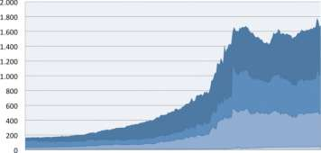

Notes & Coin I Demand Deposits ¦ General Savings ¦Time Deposits

Fig. 4.1, Broad money, Source: Central Bank of Iceland

## 4.2 Deposits increased by 19-fold in 14 years { - }

In the fourteen years from 1994-2008 broad money increased by 900%.
While the nominal GDP of Iceland roughly tripled in these fourteen
years, broad money increased tenfold.

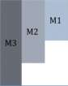

Table 4.1 Data: Central Bank of Iceland

Although all categories within broad money contributed to its tenfold
increase, two categories stand out: Demand Deposits and Time Deposits,
increasing nineteen- and twelvefold respectively.

In an attempt to understand the reason for the rapid multiplication of
the money supply in Iceland, and its effects on the economy, the
following chapters look at developments in the financial markets in
Iceland in the period of 2003-2008, a period of boom and bust of the
Icelandic banking system.

## 4.3 2001 changes in monetary policy { - }

Up until 2001 the CBI's monetary policy was based on mainly fixed
exchange rates. Since 1990 the exchange rate of the ISK had been allowed
to fluctuate within a certain bands; first by 2.25%, then by 6% in 1995
by 9% in early 2000. In 2001 the exchange rate bands on the ISK were
abolished.

In 2000, the CBI's legally mandated goals of maintaining "a suitable
money supply" and the "full productivity of the economy" were abandoned
for the single objective of promoting price stability.

The basis for the current Central Bank Act in Iceland dates from 1986 ^25^
when the role of the CBI was defined in the following way: [unofficial
translation, our emphasis in bold]

> "**3. Article.** The Central Bank is responsible for:

> Issuing bank notes, coins and bills, and making sure that the money
supply and the supply of credit is suitable so that the price level can
remain stable and the production possibility of the economy can be
reached in an efficient manner

> * Preserving and strengthening the foreign exchange reserves in order to
ensure free trade with other economies and the financial security of the
nation as it relates to other economies. The foreign exchange reserves
should be preserved, as far as possible, in safe and liquid securities
or deposits and foreign currency, which can be used for payment
anywhere.

> * Buying and selling foreign currency and supervising exchange rate
matters and foreign exchange transactions

> * Advising the government on all matters pertaining to foreign exchange
and monetary issues

> * Carrying out the banking transactions of the Treasury

> * Being the deposit institutions bank and fostering a stable and healthy
financial market."

In spring 2001 Act number 36/1986 regarding the CBI was revised. The
third article of the act, which defines the role of the CBI, now reads [unofficial translation]:

> "The main objective of the Central Bank of Iceland is to promote price
stability. With the consent of the Prime Minister, the Central Bank is
authorized to declare a numerical target for the inflation rate.

> The Central Bank shall help promote the government's economic policy as
long as such promotion is not inconsistent with its main objective
stated in paragraph l." ^26^

With the revised Central Bank Act, the CBI was longer required by law to
focus on exchange rate stability or a suitable money supply as its main
objectives. The CBI was however to watch the exchange rate developments
closely and use open market operations - buying and selling foreign
currency - if necessary, to promote price stability. ^27^

In the CBI's view, the monetary policy was thus only able to reach one
macroeconomic goal, price stability, as inflation was in the long run
"first and foremost a monetary phenomenon". ^28^

The changes in monetary policy made in 2001, put the main focus of
monetary policy on controlling inflation by setting interest rates, but
dismissed direct control of the money supply and exchange rate. This
change may have been in line with what many central banks were doing at
the time but with hindsight, it was not safe to abandon efforts to
control the money supply.

~ sidenote
^25^ _Act on the Central Bank of Iceland no. 36/1986_

^26^ _Act on the Central Bank of Iceland no. 36/2001_

^27^ _Petursson (2001)_

^28^ _Petursson (2001)_
~ 

### 4.3.1 Influencing demand and lending { - }

After the policy change in 2001 the CBI has mainly used interest rates
in the financial markets to hit its inflation target. To affect market
rates, the CBI offers to both borrow and lend reserves to commercial
banks on a short-term basis. Interest rates offered by the CBI have an
effect on short-term interest rates in the financial markets. Through
this, the CBI's monetary policy affects the borrowing, spending and
savings decisions of firms and households.

The CBI's policy rate affects price levels via a complex interaction of:

* Market interest rates

* Equity prices

* Money supply and bank lending

* Expectations and credibility

* Exchange rate of domestic currency

These factors affect domestic demand, imports and exports. Domestic
demand, imports and exports in turn affect total demand and thus the
production gap, which affects inflation. The exchange rate also affects
domestic inflation, as roughly half of consumer goods in Iceland are
imported.

An increase in the CBI's interest rate (the policy rate) is supposed to
not only reduce borrowers' demand for loans but also the willingness of
banks to lend money. The reason why higher interest reduces banks'
willingness to lend is based on the premise that raising interest rates
reduces the wealth of individuals in total as well as cash flow and
market value of firms. Higher interest rates therefore increase risk of
borrowers defaulting on loan repayments. A risk-averse bank is therefore
expected to lend less when rates become higher.

In reality, the increased policy rates have not been proven as very
effective at reducing bank lending in Iceland. In the years leading up
to the crisis, both supply and demand for loans remained strong despite
rising interest rates and the money supply continued to expand.

## 4.4 The money supply and inflation { - }

For three decades, from 1961-1990, the correlation between growth of the
money supply and inflation was remarkably strong (See Fig 4.2).
Inflation was a serious problem, topping 83% in 1983, yet there was very
little discussion of the need to restrain money creation to combat
inflation. Instead, inflation was attributed to frequent wage increases,
devaluations of the ISK and the government's lack of fiscal discipline.
Obviously, such factors can be inflationary, but excessive increases in
money supply, ranging from 20-80% per annum, must be considered as a
likely cause of inflation in the period. It may also be that the
frequent wage increases were often a response to monetary inflation
rather than a cause.

Post 1993, the strong correlation between expanding money supply and
inflation disappeared in Iceland, as it had indeed done in many other
countries a decade earlier. The cause of this was not well understood at
the time.

Post 1993, money supply continued to grow much faster than the GDP. It
grew by 40% per annum from 2003 to 2008. Yet, the average year-on-year
inflation during this period was 'merely' 5.5%. What
happened to all the money? Why did it not cause more inflation? These
questions are addressed in the following section.

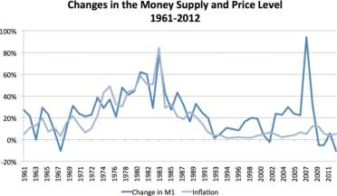

Fig 4.2 Source: Central Bank of Iceland, Statistics Iceland, Datamarket,
author's calculations

### 4.4.1 Credit creation and expanding financial sector { - }

In 1994 Iceland became member of the European Economic Area (EEA) and
adopted its laws and directives for banking and finance. This EEA's
regulatory framework introduced a sudden liberalization of Iceland's
financial sector. Banks and capital markets had remained very small in
relation to the overall Icelandic economy, but from now on these sectors
began to grow. Banks grew larger and they began to provide loans for
investing in financial assets.

By April 2008, loans to investment-related companies accounted for 46%
of the loan portfolios of the three largest banks. ^29^

Demand Deposits by Sector

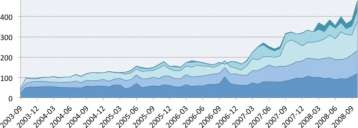

Fig. 4.3 Source: Central Bank of Iceland

Fig 4.3 shows how the money supply (Demand Deposits) by sector. All
sectors grew faster after 2006, but deposits in the financial sector
(Financial firms other than banks and holding companies) grew fastest.

Werner (1997, 2005, 2012) ^30^ has shown that an expanding financial
sector can account for the break in the correlation between increase in
money supply and inflation. In his Quantity Theory of Credit Werner
(1997) showed that nominal GDP growth is a function of bank credit
creation for GDP transactions (i.e. excluding all asset transactions).
Likewise, asset price movements are determined by bank credit creation
for asset transactions.

The financial sector in Iceland began to grow after 1994 and the growth
pace became very fast after 2006. It seems plausible that a large
portion of the quickly expanding money supply found its way into the
financial market rather than the real economy, and thus inflation
remained at relatively low levels despite the quickly expanding money
supply.

While an expansion in the financial sector is able to absorb a portion
of the money supply thereby reducing the inflationary effect of
expanding money supply, a contraction in the financial sector can free
up and direct a large portion of the money supply towards the real
economy causing inflation. The money may also cause a sudden rise in
demand for foreign currency and a drop in the exchange rate.

Although the financial sector can for a time mop up excessive expansion
of the money supply, the tide can quickly turn with grave consequences
for the real economy. A central bank that focuses on price stability in
the real economy, while ignoring an expanding money supply and asset
inflation, may therefore be inviting trouble further down the road.

~ sidenote
^29^ _Special Investigation Commission Report, ch. 15.5.3_

^30^ _Richard A. Werner (2012). Towards a New Research Programme on
'Banking and the Economy' -Implications of the Quantity Theory of Credit
for the Prevention and Resolution of Banking and Debt Crises,
International Review of Financial Analysis, 25, 94-105_

~ 

### 4.4.2 The exchange rate and the price level { - }

During 2002-2008 the ISK appreciated by 23% (Fig. 4.4). This was a side
effect of rising policy rates, an effort by the CBI to curb the lending
boom in Iceland. The high interest rates encouraged growing demand for
ISK from abroad, which lead to appreciation of the ISK. This in turn
reduced the price of imported goods and increased consumption, which
increased the trade deficit. While causing negative side effects, the
higher policy rates did little to stop the domestic lending boom.

In Iceland, imports of goods and services amount to roughly half of GDP.
Imported goods constitute a large portion of the consumption basket in
Iceland. Therefore, a strengthening of the ISK reduces measured
inflation. ^31^

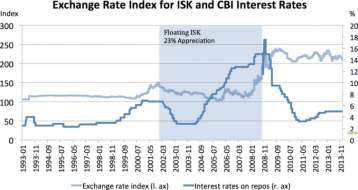

Fig. 4.4 Source: Central Bank of Iceland

To quote the CBI on the effects of policy rate on the exchange rate:

> "If interest rates on domestic securities are higher than similar
foreign securities it may be beneficial to investors to own domestic
securities. This is, among other things, contingent on a stable exchange
rate. This leads to an increased inflow of capital to the economy, thus
increasing the demand for ISK. Under normal circumstances, an increase
in the interest rate thus leads to an appreciation of the ISK, which in
turn reduces the price of imported products, which, other things being
equal, directly reduces the inflation rate. " ^32^

High policy rates had propped up the currency and helped to reduce
inflation for a few years 33 but in the long run the consequences of
excessive money creation could not be escaped. Between October 2007 and
October 2009 the ISK depreciated by 50%, which consequently fed into the
inflation rate; a year-on-year rate of around 12% in 2008 and 2009.

~ sidenote
^31^ _Estimates show that a 1% weakening of the ISK leads to 0.4% increase
in inflation - Petursson (2008)_
~ 

### 4.4.3 Banks expanded the money supply by 40% annually { - }

We will now take a closer look at the quick expansion of money that
began after 1999 and culminated with the crash in 2008 while considering
the CBI's failed efforts to curb the expansion.

In 2002 two of Iceland's largest banks were privatised. In the spring of
2003 the newly privatized banks commenced to expand the money supply at
accelerating pace. Between spring 2003 and fall 2008 the money supply
increased seven-fold, an average increase of around 40% per year.

ISK Bn. 600

Money Supply (Ml)

Fzgr. 4.5 Source: Central Bank of Iceland

The CBI tried to slow down the banks' money creation by raising interest
rates from 5% to 18%. (See Fig. 4.6). Despite these dramatic increases
in policy rates by the CBI, the commercial banks proceeded to expand the
money supply until halted by the crash of 2008.

Central Bank Interest Rates

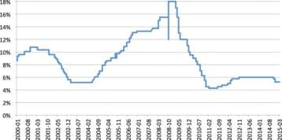

Fig. 4.6 Source: Central Bank of Iceland

As early as 2000, the CBI warned that rapid growth in lending could lead
to crisis: [Our emphasis]

> "Given how costly financial crises may prove, preventive action is
important. This needs to be based on signals, which suggest the presence
of risk in good time... The most important macroeconomic indicators,
which deserve to be monitored, are the following: Large growth in
lending. **Very rapid growth has often preceded a serious financial
crisis**. There is a risk that rapid growth will be accompanied by a
deterioration in the quality of credit institutions' portfolios. " ^34^

In 2006, by which time the Icelandic banks had begun to capture the
attention of foreign analysts, the CBI wrote in its Financial Stability
Report: [Our emphasis]

> "Total debt of households, businesses and the aggregate economy rose at
a record pace in 2005. So, in fact, did the value of assets. Much of the
increase in corporate and national debt is explained by investment in
foreign equities and foreign lending by the banking sector. Nonetheless,
Iceland's net external debt soared during the year. International
financial conditions have been exceptionally favourable in recent years,
enabling domestic financial institutions to maintain brisk lending
growth for longer than otherwise. The Central Bank of Iceland has often
pointed to the risk that deterioration in financial conditions may
coincide with the inevitable adjustment of the economy. ... **growth in
domestic lending is far in excess of a level compatible with stability**.
Although this lending meets credit quality criteria, growth on such a
scale heightens the risk of later impairment. Lending growth has
remained buoyant so far in 2006 and clear signs of an improvement have
yet to be seen." ^35^

It is clear that CBI's warnings did little to curb the expansion. The
commercial banks continued to expand the money supply at growing pace.

~ sidenote
^32^ _Central Bank of Iceland (2014b)_

^33^ _See, for example, Baldursson & Portes' (2013) discussion on the carry
trade in Iceland in the mid to late 2000's._
~ 

## 4.5 What enabled expansion of money in the 2000s { - }

This chapter reviews the rapid expansion of the money supply in the
2000s and considers which model fits the facts better: the money
multiplier model or the credit creation model.

The money multiplier model implies that the CBI is in control of the
money supply by controlling the amount of base money in the system and
setting the reserve requirement. If correct, this would suggest that the
seven-fold increase of the money supply in the 2000s could
not have happened without the CBI either causing or allowing it to
happen.

On the other hand, the credit creation model implies that the CBI is not
in control of the money supply. Commercial banks can create money by
lending and the CBI has to provide reserves when needed.

~ sidenote
^34^ _Central Bank of Iceland (2000)_

^35^ _Central Bank of Iceland (2006)_
~ 

### 4.5.1 The CBI Reduces the Reserve Requirement and Increases Base Money { - }

The CBI reduced the reserve ratio for deposit institutions in early 2003
and then again in December 2003. For savings deposits tied in accounts
for two years or more, the ratio fell from 1.5% to 1%, and then to 0% in
December 2003. For other deposits the ratio fell from 4% to 3%, and then
finally to 2%. ^36^, ^37^ The CBI stated that this reduction was made to
harmonize the regulatory environment for financial institutions in
Iceland with the EU.

According to the money multiplier model (MMM), halving the reserve
requirement should have enabled a doubling of the money supply. Indeed,
the money supply doubled between 2003 and 2007 (Fig. 4.7) which seems to
validate the money multiplier model. However, critics of the MMM would
point out that reserve requirement do not act as a limit to money
creation by banks, so the change in the reserve ratio was unlikely to be
the causative factor behind the increase in the money supply.

Another doubling of broad money occurred between mid-year 2007 and until
the banks collapsed in the fall of 2008. This time, there was no change
in the money multiplier. The MMM would explain that there was an
increase in CBI reserves, and this enabled banks to create more money.
Critics of the MMM would reply by pointing out that banks first make
loans and then request reserves, and the CBI must comply to avoid
creating a liquidity shortage and potential payments crisis between the
banks. Therefore lending came first, then the reserves.

Ml doubles from spring '03 to spring'06

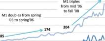

Base money (M0) Money supply (Ml)

Fig. 4.7 Source: Central Bank of Iceland

~ sidenote
^36^ _Central Bank of Iceland (2014g)_

^37^ _Regulation on reserve requirements (Ice: Reglur um bindiskyldu), no. 906/2003_
~ 

### 4.5.2 The reserve requirement did not restrict money creation { - }

From mid-year 2003 the reserve requirement was 2% and it was not until
spring 2007 that base money started to increase. However, the banks were
able to increase the money supply threefold in just two years, from
mid-2006 to mid-2008.

In the two years running up to the crash, the CBI had to provide
liquidity (by creating and lending central bank reserves) to Icelandic
banks. As the CBI describes in its 2009 Financial Stability Report:

> "Financial institutions' demand for Central Bank collateral loan
facilities surged in 2008, and until the banking system collapsed that
October, the Central Bank was their chief source of liquidity. In 2007
and 2008, the Central Bank amended its Rules on Central Bank Facilities
for Financial Institutions so as to facilitate access to liquidity, as
the liquidity shortage had begun to cause problems in payment systems,
among other things." ^38^

In less drastic times, excessive demand for reserves may push interest
rates to undesirable levels. To prevent this, a central bank will inject
reserves into the system.

Indeed, the CBI's Monetary Bulletin in 2000 mentions:

> "On first impression it may appear rather risky to allow the total
amount of Central Bank facilities to be determined by bids from
credit institutions, but it should be remembered that the Bank attempts
to manage short-term yields rather than money stock, with the aim of
exerting an impact on other interest rates, currency movements, exchange
rate and demand in the economy. Its ultimate goal is price stability."

~ sidenote
^38^ _Central Bank of Iceland (2009)_
~ 

#### 4.5.2.1 Banks grew in tandem reducing their need for reserves { - }

If the banks increase their lending at a similar rate, they may need
very little reserves for the expansion. First of all, when a borrower at
Bank A uses his loan to pay another customer of the same bank, then Bank
A will need no extra reserves. On the other hand, if the borrower at
Bank A uses the money to pay a customer of Bank B, then there will be a
flow of reserves from Bank A to B.

Considering the large number of bank customers borrowing and
transferring funds between banks, the flows of reserves between banks
are likely to be great in both directions. If banks A and B happen to
grow their lending at similar rates, then the flow of reserves between
them will more or less cancel each other out. Banks that grow in step
with each other can therefore expand whilst requiring only a minimal
increase in reserves.

As can be seen in Fig. 4.8 the assets of the Icelandic banks grew more
or less in tandem throughout their expansion period, which reduced their
need for reserves.

Internal Growth of Big Three Banks

_10)0%_

_80)% 60% 40% 20% 0% -20%_

_20)04 2005 2006 2007 2008_

-*-Glitnir Landsbankinn Kaupthing

Fig. 4.8 Source: Special Investigation Committee

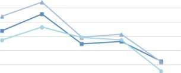

### 4.5.3 Equity requirements did not restrict money creation { - }

Equity requirements did not restrict the Icelandic banks from extending
loans. Profits were strong and equity grew quickly thereby making ever
more lending possible. As can be seen in Fig 4.9 the profits of the
three big banks increased dramatically in the years before the financial
crisis. Their combined profits (right axis) rose from just under ISK 11
bn in 2002 to roughly ISK 140 bn in 2007.

Profits of Big Three Commerical Banks

ISKBn 180

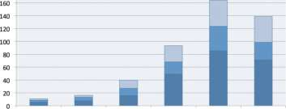

_20)02 2003 2004 2005 2006 2007_

¦ Kaupthing (incl. Bunadarbankinn in 2002) ¦Glitnir I I Landsbankinn
Fig. 4.9 Source: Central Bank of Iceland

In the period 2002 to 2007 the equity of the three big banks' increased
by a factor of ten; from ISK 70 bn to ISK 695 bn (Fig 4.10). Given that
the equity requirements for the banks remained unchanged throughout this
period it is clear that the banks' room for lending and consequent money
creation grew ten-fold in these five years. Indeed the combined assets
of the three big banks went from roughly ISK 1,000 bn to ISK 10,000 bn
in the five-year period.

Growing Equity of the Big Three Commerical Banks

ISK Bn. 800

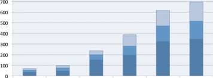

_20)02 2003 2004 2005 2006 2007_

¦ Kaupthing (incl. Bunadarbankinn in 2002) ¦ Glitnir Landsbankinn

Fig. 4.10 Source: Central Bank of Iceland

### 4.5.4 The CBI's higher interest rates did not reduce money creation { - }

In 2006 and 2007 the year-on-year inflation rate in Iceland was 6.8% and
5.0% respectively. In the first 10 months of 2008 the average
year-on-year inflation rate was around 12%. During this time the CBI had
conveyed its concerns regarding excessive domestic consumption in
Iceland. Policy rates were raised significantly, with rates on repos and
reserves raised to around 13%, up from 4% from early 2006. These
increases did little to reduce money creation by the banks.

### 4.5.5 Did the Central Bank ignore the money supply? { - }

The Special Investigation Committee concludes that:

> "\[T]he willingness of the Central Bank \[of Iceland] to accept bonds
and bills \[issued by the banks themselves] as collateral meant a
transfer of the power of money printing to the banking system." ^39^

In its report the Special Investigation Committee (the SIC) tried to
offer a logical explanation as to why the CBI did not attempt to counter
the rapid increase in money supply [unofficial translation]:

> "Although today's central banks use policy rates to reach their
inflation goals it is common that they also keep an eye on the money
supply, specifically in order to increase their credibility. For
example the European Central Bank has a certain money supply criteria
that it follows in addition to its interest rate rules (a two pillar
approach). The money supply is also used as an intermediate target when
monitoring financial stability, as research has shown that rapid growth
in the money supply is a crucial clue as to [an imminent] dual crisis,
i.e. currency and financial crisis. In Iceland the money supply
increased without any attempt [by the Central Bank of Iceland] to
counter the increase. **It could be claimed that after the inflation
target approach was instated [the Central Bank] entirely ignored that
increased money in circulation was a signal of an overheating [banking
system]**. This was, among other things, due to the fact that it was not
fully clear to the Central Bank why the money supply was increasing." i0
[Our emphasis in bold]

The SIC concludes that the CBI did not intervene to counter the
expanding money supply because the CBI did not understand why the money
supply was increasing.

There is of course an alternative explanation; that in the fractional
reserve system the CBI has no alternative but to provide reserves as
needed.

The latter view is perhaps supported by a comment that Sturla Palsson,
director of Treasury and Market Operations at the CBI gave to the
Special Investigation Committee. He and other staff of the CBI believed
that the banks had in fact gone bankrupt in the fall of 2007 and that
from that time on, the liquidity provisions from the CBI to the banking
system actually constituted emergency lending. ^41^

The SIC does point out that as a general rule a Central Bank provides a
bank with liquidity (i.e. loans of reserves) if the bank is suffering
from a temporary liquidity shortage. In this transaction the loan of
reserves is given in exchange for reliable collateral. However, it is
the common consensus that supplying liquidity to a financial institution
that is going bankrupt is not acceptable. ^42^

It is also clear that if one of the three large banks in Iceland had
become insolvent, it was likely that other banks would suffer the same
fate. Due to the nature of the fractional reserve system where
liabilities of private banks form the bulk of the money supply, the
payments system itself is dependent on banks' continuing liquidity and
to a lesser extent, solvency. Any sign of a major bank failing
therefore threatens the total collapse of the payments system, and the
inability of members of the public to withdraw money or make payments.
This means that the government has no option, when a major commercial
bank fails, other than to intervene and guarantee the deposits with
taxpayer money.

That is what happened in Iceland. In the boom years, commercial banks
expanded the money supply and the CBI was unable to slow them down. When
liquidity became scarce the banks turned to the CBI who had no
alternative but to provide reserves to avoid destabilizing the system.
Despite its efforts the banks eventually collapsed.

If the power to create and expand the money supply remains with
commercial banks, a similar crisis can happen again. Indeed similar bank
crisis have occurred many times before in several advanced economies
including the UK in the 1970s, and in the 1990s Finland, Norway and
Sweden.

Adair Turner, the chairman of the UK's Financial Services Authority,
member of the BoE's Financial Policy Committee, set out his view of the
fundamental cause of the financial crisis ^43^ :

> "The financial crisis of 2007/08 occurred because we failed to constrain
the private financial system's creation of private credit and money."

While the fractional reserve system allows private banks to create the
money supply, further bank crisis may be inevitable.

~ sidenote
^39^ _Special Investigation Report (2010), part 1, page 166_

^40^ _Special Investigation Report (2010), part 1, page 187_

^41^ _Special Investigation Report (2010), part 1, page 165_

^42^ _Special Investigation Report (2010), part 1, page 165_

^43^ _Adair Turner - speech to the South African Reserve Bank on Friday 2nd Nov 2012_
~ 

# 5 Fractional reserve issues { - }

This chapter reviews some of the problems that critics have attributed
to the fractional reserve system. These problems include the risk of
bank runs and the inefficiency of deposit insurance, particularly in a
market such as Iceland that is dominated by three large banks. Each of
the three large banks is too big to fail. Banks have in-built incentives
to increase risk. When banks get in trouble, they must be saved at
taxpayers' expense.

The CBI is unable to stop commercial banks from expanding the money
supply far beyond what is compatible with the economy.

Banks are allowed to lend money into existence under the fractional
reserve system while the state itself could lend or spend it into
existence. Money creation by banks therefore means more household debt
than would be necessary if the state created the money supply.

The considerable income from money creation also accrues to the banks
instead of the state.

## 5.1 Deposit Insurance { - }

The purpose of Deposit Insurance is to reduce the risk of bank runs. A
bank run can start if depositors fear that their bank could be in
trouble. Because banks finance their long term lending with demand
deposits, they hold only enough cash (or reserves) to pay out a fraction
of deposits at any one time. A bank run can therefore lead to a
liquidity crisis for the bank. This in turn could force the bank to hold
a 'fire sale' of assets in order to raise liquidity, leading to a price
drop in financial markets. The panic can then spread to other banks,
causing a full-scale financial crisis.

In accordance with EEA (European Economic Area) regulation, the
Icelandic government is responsible for ensuring that a deposit
guarantee fund is operated. The Depositors' and Investors' Guarantee
Fund (TIF) is a private foundation operating pursuant to Act No.
98/1999. The objective of the Act is to guarantee a minimum level of
protection to depositors in commercial and savings banks, should a bank
fail to meet its obligations, for example due to default. ^44^ This
guarantee, known as 'deposit insurance', is set at 20,000 EUR but is
payable in ISK. In the event of insolvency the TIF offers depositors to
pay out a minimum guarantee in return for the depositors' claim to the
failed bank. If the TIF is able to recover more than the minimum
guarantee, the proceeds go to the depositors, capped at the total
deposits.

The guarantee fund's assets are required to be the equivalent of at
least 1% of all guaranteed deposits in the previous year in Iceland and
funded by annual dues from the banks. ^45^

As with other insurance schemes, it is desirable to have many
participating banks that are not interdependent or likely to get into
trouble simultaneously. Unfortunately, in Iceland the three large banks
have more than 96% share of deposits and they are in many ways dependent
on each other, and dependent on the same small economy.

In early 2000, deposits in Icelandic banks amounted to ISK 250 bn while
the TIF's assets were ISK 2.9 bn or 1.2% of the total deposits.

By the fall of 2008, deposits in Icelandic banks - excluding deposits of
financial firms - had grown to ISK 3,100 bn thereof nearly ISK 1,700 bn
were in branches outside Iceland. The TIF contained only ISK 13 bn, or
0.41% of total bank deposits. ^46^ Clearly, the deposit insurance fund was
in no way sufficient to halt a bank run, or to reimburse more than a
fraction of deposits of a failed bank.

~ sidenote
^44^ _TryggingarsjoSur innstaeSueigenda og fjarfesta (2014)_

^45^ _Special Investigation Report (2010), part 5, pages 203-204_

^46^ _Special Investigation Report (2010), part 5, page 193_
~

Indeed, when a bank run began in 2008 the government had no option other
than to declare that all deposits in domestic banks were guaranteed in
full by the state.

The practice of maintaining the TIF in Iceland, gives the illusion that
the banks themselves are funding the insurance against their failure,
when the reality is that bank deposits must be guaranteed by the state,
at taxpayers' expense.

----

**Box 5.A**

> **Emergency Legislation and Capital Injection**

> Emergency measures were taken in October of 2008 in response to the
banking crisis in Iceland. An emergency legislation was passed by
parliament in early October of 2008 where all domestic assets of the
three big deposit institutions; Kaupthing, Glitnir and Landsbankinn,
were transferred along with domestic deposits to new banks at "fair"
value. The new banks were capitalized by the government and
resumed the role of the old banks in running the payment system.

> The operations and assets of the old banks abroad were put into
liquidation. Deposit holders were given priority over other creditors of
the banks. Thus, deposits in foreign branches were given priority to
other claims at the old banks. ^47^

> According to the National Audit Office, the government injected roughly
ISK 130 bn into the new banks. In addition the Icelandic government took
over claims held by the CBI for the amount of ISK 370 bn due to
collateral lending to financial institutions, of which ISK 190 bn were
immediately written off. The estimated loss of the state (Treasury and
the CBI) due to loans to the banking system before the crisis was
estimated at ISK 270 bn, or close to 20% of 2008 GDP. ^48^

----

Deposit insurance has further downsides. It removes the incentive for
depositors to monitor their bank's risks. In a system without deposit
insurance, depositors would have an incentive to continuously monitor
their bank's risk to ensure the bank does not act in a manner that may
endanger solvency. Other things being equal a bank with a higher capital
ratio would be considered safer and in consequence could be expected to
attract more customers ^49^ and its depositors would demand lower interest
rates. When customers lack the incentive to pay attention to the risk
taken by banks, banks will compete simply by offering the highest
interest rates on deposits without regard to risk. Deposit insurance can
therefore lead to more risk taking by banks, which increases the
likelihood of bank failures.

~ sidenote
^47^ _Arnason (2011), Baldursson (2011)_

^48^ _Government Offices of Iceland (2012), National Audit Office (2012)_

^49^ _This would reduce their capital ratio and thus prove self-limiting,
unless continued retained earnings and capital raising maintains the
high ratio._
~ 

### 5.1.1 The too-big-to-fail problem { - }

Each of the three large banks in Iceland is considered too big or too
important to fail. Unfortunately, this does not mean that these banks
can't fail. It simply means that when any of these banks gets into
trouble the government has no alternative but to save it.

If one large bank were allowed to fail, this would mean that almost a
third of the population and companies could not access their deposit
money and would therefore be unable to do business or pay for
necessities. Emergency liquidation of assets by a large failing bank
would cause a price fall in financial markets and the problem could soon
spread to other banks and companies. Governments will do what
it takes to prevent such a scenario from developing, usually at great
cost to taxpayers.

In its 2014 Global Financial Stability report, the International
Monetary Fund (IMF) tries to estimate the implicit subsidy for banks,
which are considered Too-Important-To-Fail (TITF). The IMF summarizes
its results in the following way:

> "Government protection for too-important-to-fail (TITF) banks creates a
variety of problems: **an uneven playing field, excessive risk-taking, and
large costs for the public sector.**
Because creditors of systemically important banks (SIBs) do not bear the
full cost of failure, they are willing to provide funding without paying
sufficient attention to the banks' risk profiles, thereby encouraging
leverage and risk-taking. SIBs thus enjoy a competitive advantage over
banks of lesser systemic importance and may engage in riskier
activities, increasing systemic risk. Required fiscal outlays to bail
out SIBs in the event of distress are often substantial."

## 5.2 Lending for speculation vs economic growth { - }

There is a widespread belief, that despite all its risks, fractional
reserve banking has been instrumental for economic progress. If banks
were not able to create money, the argument goes, fewer economic
opportunities would be harnessed.

Yet, analysis of the share of mortgage loans in total bank lending for
17 advanced economies from 1870 until present shows that the sharp
increase in debt to GDP ratios in the 20th century is mainly a result of
rapid growth of mortgages. The share of mortgages of banks' total
lending has doubled from 30% in 1900 to 60% today. By contrast
non-mortgage bank lending to companies for investment and non-secured
lending to households has remained stable in relation to GDP. ^50^

In Iceland, the data (Fig 5.1) indicates that most new money created by
banks was lent to borrowers that invest; in existing assets, in existing
real estate or for speculation in financial assets while a minor share
was lent into the real economy; to fund new business, invest in new
technology, create new jobs, and build new housing or infrastructure.

In the five year period from 2003 to 2008, loans extended by deposit
institutions to domestic entities (excluding FX loans) increased by ISK
1,400 bn. Thereof, approximately ISK 620 bn, or 45%, were loans
made to financial firms other than deposit institutions, holding
companies and companies that are in the aforementioned "unknown" sector,
with the increase in household loans around 40% of this figure. See Fig
5.1.

In the last two years of this period almost two thirds of the money
created by banks was lent to financial and holding firms.

Users of New Money: ISK Loans From Banks

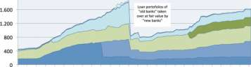

Fig. 5.1 Source: Central Bank of Iceland. - Includes real estate
companies before 06/2011. - Includes mortgages before 07/2007

The point here is not that banks do not want to lend to the real
economy. Opportunities for lending to companies are however limited by
various factors. The growth of companies is limited by many other
factors than access to funding. Resources may be scarce, demand may be
limited, and companies may prefer equity finance to bank loans.

Banks are not faced by similar limitations when lending for financial
speculation. Lending for investment in existing assets tends to increase
demand for assets, leading to higher asset prices, expectations of
future asset price increases, more demand, and more lending possible.
This feedback loop and growth in private leverage has been described by
Adair Turner as

> "A major cause of the crash of 2007 and the predominant reason why the
post crisis recession was so deep and the recovery so weak and slow. "
^51^

Because the economy is dependent on using bank deposits as money, banks
must comply with regulations (Basel) that favour lending against
existing collateral over lending towards business. The unwanted side
effect of such regulation is to further divert bank lending towards
existing assets rather than lending for growth.

~ sidenote
^50^ _The Great Mortgaging - Jorda, Taylor, Schularick - 2014_

^51^ _Escaping the debt addiction - Adair Turner - 2014_
~ 
## 5.3 Commercial banks control the money supply { - }

### 5.3.1 Is the CBI not in control? { - }

Since 1961, when the CBI was founded there has been very little evidence
of the CBI having (or taking) effective control of the money supply. Its
warnings of too much lending had no noticeable impact on banks' lending
behaviour. The CBI's efforts to raise interest rates in the years
leading up to the crisis did not halt the fatal credit bubble from
expanding. ^52^

When the banks needed liquidity, the CBI was not able to deny them
reserves.

For more than half a century, the money supply in Iceland has been
determined first and foremost by the lending activities of the
commercial banks and not by the policy decisions of the CBI.

### 5.3.2 Have banks created an optimal amount of money? { - }

Since 1961, commercial banks have, with few exceptions, expanded the
money supply much faster than the real economy was growing. The
consequences of their uncontrolled money creation include inflation,
hyperinflation, and devaluations of the ISK, asset bubbles and a bank
crisis.

Commercial banks have created money in such excess that the ISK has lost
99.7% of its purchasing power in just 50 years.

Between 1994 and 2008 the banks expanded the money supply by a factor of
ten, while nominal GDP only tripled. The rapid expansion of the money
supply was disastrously out of proportion to the needs of the economy
with most of the money going not into the real economy but into
speculative financial markets and asset price bubbles.

Banks that create too much money are not doing so out of ignorance. On
the contrary, by using the power to create money within the current
system, each bank is simply acting in the best short-term interest of
its shareholders, by maximising the amount of interestbearing loans issued, and therefore maximising interest income for the
bank.

It seems reasonable to expect that without reform of the fractional
reserve system, commercial banks may keep lending and expanding the
money supply as creditworthy borrowers can be found. The CBI will not be
in a position to stop them.

Fortunately, there are some alternatives to the current fractional
reserve system that could reduce the odds of financial crisis in the
future.

~ sidenote
^52^ _When the CBI raised interest rates in ISK the banks began offering_
foreign loans domestically at very low rates.
~ 

# 6 Alternatives to fractional reserve { - }

In order to evaluate the costs and benefits of fractional reserve
banking it is useful to take a look at some alternatives. A variety of
alternatives have been proposed in the last century but none of them
have been implemented yet.

In this chapter we provide an outline of the following proposals for
reform:

* The Chicago Plan, as proposed in Benes' and Kumhof s paper in 2013

* Kay's Narrow banking proposal from 2009

* Kotlikoff's Limited Purpose Banking (LPB) from 2010

* The Sovereign Money Proposal (2014)

The Sovereign Money Proposal is covered in more depth as it provides a
good understanding of the issues and it seems to solve the main issues
with minimal changes to the current system.

## 6.1 The Chicago Plan revisited { - }

After the Great Depression eight economists from the University of
Chicago put forth a proposal for monetary reform in a memorandum to the
President of the United States. ^53^ This proposal, later known as the
Chicago Plan, advocated for 100% reserve banking; where each bank
deposit that could be withdrawn on demand would be backed in full by an
equivalent reserve of cash or deposits at the Federal Reserve.
Variations of the proposals were put forth by respected economists,
among them Fisher (1936) and Friedman (1948). ^54^ Although proposals
varied between economists, all agreed that it would be necessary to
separate the money creation from the lending activity of banks. This
way, the money supply would not be determined by or dependent on bank
lending and the solvency of the banking sector. In an IMF working paper,
Benes and Kumhof (2013) modelled the effects of a 100% reserves banking
system in the US economy with a DSGE 55 model. According to Benes and
Kumhof:

> "Our analytical and simulation results fully validate Fisher's (1936)
claims. The Chicago Plan could significantly reduce business cycle
volatility caused by rapid changes in banks' attitudes towards credit
risk, it would eliminate bank runs, and it would lead to an
instantaneous and large reduction in the levels of both government and
private debt. It would accomplish the latter by making government-issued
money, which represents equity in the commonwealth rather than debt, the
central liquid asset of the economy, while banks concentrate on their
strength, the extension of credit to investment projects that require
monitoring and risk management expertise. We find that the advantages of
the Chicago Plan go even beyond those claimed by Fisher. One additional
advantage is large steady state output gains due to the removal or
reduction of multiple distortions, including interest rate risk spreads,
distortionary taxes, and costly monitoring of macro economically
unnecessary credit risks. Another advantage is the ability to drive
steady state inflation to zero in an environment where liquidity traps
do not exist, and where monetarism becomes feasible and desirable
because the government does in fact control broad monetary aggregates. "
^56^

In Fisher's description of the Chicago Plan (1936) other, more general
benefits were also noted, among the return to a simpler banking system.

The Chicago Plan Revisited has helped to explain the flaws of the
fractional reserve system and modelled one possible avenue for reform of
the monetary system.

~ sidenote
^53^ _Knight, F. (1933). "Memorandum on Banking Reform", March, Franklin D.
Roosevelt Presidential Library, President's Personal File 431._

^54^ _Fisher, I. (1936). 100% Money. New York: Adelphi_

_Friedman (1948). "A Monetary and Fiscal Framework for Economic
Stability". The American Economic Review 38.3: 245-264._

^55^ _Dynamic Stochastic General Equilibrium_
~

## 6.2 Narrow banking { - }

Narrow banking proposals emphasize the prevention of contagion in the
financial system. Many of the proposals were set forth in the late 1980s
to early 1990s, shortly after the financial liberalization and
securitization took place in western financial markets and the savings
and loans crisis occurred in the United States. ^57^ Proposals vary in
terms of implementation and detail, however they all suggest that the
two major functions of banks - deposit-taking and payments services, and
lending - should take place within different institutions to avoid
financial contagion. John Kay (2009) explains that

> "Financial services companies must be structured so that in the event of
an overall failure of the organization the utility can be readily
separated from the casino."

~ sidenote
^56^ _Benes and Kumhof, The Chicaco Plan Revisited, 2012_ 

^57^ _See Litan (1987), Pierce (1991) and Bryan (1991)_
~ 

### 6.2.1 The narrow bank { - }

The term 'narrow bank' is used to describe the banking entity, which
specializes in deposit-taking and payment activities. A narrow bank does
not provide lending services. However, as Kobayakawa and Nakamura (2000)
mention, the definitions of narrow banks vary greatly. Pierce (1991)
proposed that narrow banks should be limited to investing in safe
short-term assets such as treasury bills. And Bryan (1991) suggests
allowing narrow banks to lend money to small firms. Narrow banks would
provide checking accounts and transfers and be permitted to pay interest
on all their accounts.

Kobayakwa and Nakamura (2000) evaluated several narrow banking proposals
in an effort to determine which narrow bank model would best serve the
purpose of achieving financial stability. They categorized the proposals
by means of two standards:

* Whether the assets that a narrow bank is allowed to hold are limited
to short-term

* Whether a narrow bank is allowed to take part in lending activities

Kobayakawa and Nakamura conclude that the most desirable narrow bank
proposal is the one that allows a bank to take deposits as well as
provide loans, although such lending activities would be restricted. The
desirable narrow bank would be allowed to invest in safe short-term
assets. Kobayakawa and Nakamura, however point out that one of the main
limits to their analysis is that they focus only on the liquidity risk,
without paying heed to credit risk. That is a bank run only happens in
their analysis due to unexpected deposit withdrawal, rather than an
increase in nonperforming bank loans.

Narrow banks would be the only banks to receive any government
guarantee, for example deposit insurance, and have access to lender of
last resort funding. As mentioned, it has been suggested that these
banks be required to hold liquid safe securities such as government
bonds, although some proposals allow for extending credit to small
firms. ^58^ To the extent that safe government assets are in amount equal
to deposits, the plan constitutes full reserve banking. Kay (2009)
believes the most effective way to prevent any form of public subsidy to
a failed financial institution is to require that retail deposits which

qualify for deposit insurance be 100% supported by safe and liquid
assets, ideally government securities. ^59^

~ sidenote
^58^ _Kobayakawa (2000)_

^59^ _Dixhoorn (2013)_
~ 

### 6.2.2 The investment bank { - }

The investment banks in the narrow banking proposals are sometimes
referred to as financial holding companies. Investment banks make loans
and are to be fully funded by debentures and equity. They take care of
all non-monetary activities of current commercial banks, yet are not
able to take deposits. Investment banks would not have to be bailed out
with public funds when they fail. They would have to match the maturity
of their own liabilities and investments. ^60^

The variations of the proposals discuss whether the investment banks
should be separate entities or subsidiaries of narrow banks. In any
case, the separation needs to be monitored to ensure that investment
banks do not use the assets of the narrow banks and that investment
banks do not have access to the payments system of the narrow banks. ^61^

~ sidenote

^60^ _De Grauwe (2008)_

^61^ _Dixhoorn(2013)_
~ 

### 6.2.3 Benefits of narrow banking { - }

According to Phillips (1995), the separation of monetary and financial
service companies, i.e. narrow banks and investment banks, solves a
number of problems with respect to the financial system.

* Enhances the safety of the payments system, as very safe and liquid
assets back deposits. Bossone (2002) also mentions that by forcing banks
to hold high-quality instruments, such as government securities,
narrow-banking regulation would minimize any liquidity and credit risk
banks may have.

* Reduces the need for government regulation of banks. In this context
Phillips mentions that there will be more supervision and less
regulation. For the narrow banks, supervision would be required to
determine whether a bank is holding assets, which can back its deposit
liabilities.

* Would make deposit insurance redundant or minimal, because the narrow
bank's liabilities will already be backed by state liabilities (i.e.
government bonds).

In addition, Phillips (1995) mentions that under the reform monetary
policy would be separate from credit policy. Today, in fact, we view
these tasks, monitoring money and credit as "intertwined" as under
the current system monetary policy is simultaneously credit policy.
However, in a reformed narrow banking system Phillips contends that the
Central Bank would play a major role in monetary policy but a minor one
in lending. This would simplify the system. In similar vein, Kay (2009)
points out that optimal environment would be one with minimum
regulation, where the market takes on that responsibility. Finally, Kay
(2009) also suggests as an additional measure that retail depositors be
given priority over general creditors when it comes to liquidation.

## 6.3 Limited Purpose Banking { - }

In Kotlikoffs (2010) view, the main problem with the fractional reserve
system is that banks use state guaranteed deposits to fund their
'gambling' at the taxpayers' expense.

Kotlikoffs 'Limited Purpose Banking' (LPB) proposal is to limit banks to
their original purpose: to intermediate between borrowers and investors.
Kotlikoffs reform builds on the mutual fund model. In LPB all banks that
participate in financial intermediation, i.e. financial and insurance
companies with limited liability, operate as holding companies of
unleveraged pass-through mutual funds. Banks would offer securities
ranging from safe to risky. Kotlikoffs proposal assumes that banks would
never own financial assets or borrow to invest in assets other than
those needed to run their mutual funds' operations (such as buildings,
office furniture etc.). Hence, it is the customers who are leveraged,
not the banks. As the banks function as simple middlemen, all risk is
borne by the investors themselves. ^62^

Kotlikoff acknowledges that the LPB system cannot fully prevent
irrational collective exuberance, which can lead to financial
instability. However, in the reformed system the effects of such
negative consequences will be limited to those who willingly took part
in the activities that led to the instability. In this way Kotlikoffs
system aims to better align risk and return in the economy and simplify
the financial system. ^63^

All securities in the LPB system need to be evaluated by a Financial
Services Authority (FSA). This is so it is clear what is being bought
and sold. The FSA can hire private companies, working only for it, to
verify, appraise, rate, custody and disclose all securities held by
mutual funds. All of the securities must be assessed by the FSA. The
point is not to ban any securities but to ensure that investors are
informed. The LPB can only buy and sell 'FSA-processed' and disclosed securities at
auctions so all issuers of securities receive a fair price for their
paper.

According to Kotlikoff, since LPBs are not permitted to hold risky
assets and hold no debt, capital requirements are not necessary.

After the reform individuals are still free to buy and sell individual
securities outside of LPBs. LPBs would be able to broker such
transactions, but not hold any securities. The proposal suggests that
the FSA establish an escrow service for the transfer of money to sellers
and the securities to buyers. In this way, the FSA, not the
broker-dealers would clear the securities markets. Financial firms
organized as proprietorships and partnerships that do not have limited
liability will be free to invest. These firms do not rely on the
government to limit their losses and are thus free to 'make gambles' and
take on all manner of risk. Individuals operating as conventional banks,
yet without limited liability, would be personally liable for their
losses. ^65^

In the LPB proposal all limited liability financial intermediaries
including: commercial banks, investment banks, insurance companies,
hedge funds, private equity funds, credit unions and other limited
liability intermediaries, must play by the same rules: as mutual fund
holding companies which issue 100% equity financed mutual funds. This
simplifies the financial system and increases transparency.

Since the mutual funds are not leveraged, they cannot fail even if their
assets lose value. The same goes for their parent holding company. It is
hence claimed that the financial system will never fail under Limited
Purpose Banking. Although shadow banks will be permitted to leverage,
they are without limited liability and therefore risk averse.

~ sidenote
^62^ _Kotlikoff (2010)_

^63^ _Kotlikoff (2010)_

^64^ _Chamley Kotlikoff & Polemarchakis (2012)_

^65^ _Goodman & Kotlikoff (2009)_
~ 

# 7 The Sovereign Money Proposal { - }

The Sovereign Money Proposal has its origins in a proposal first put
forward by Frederick Soddy in the 1920s, and then later by Irving Fisher
and Henry Simons in the aftermath of the Great Depression. Variations of
these ideas have since been proposed by Friedman (1960), Tobin (1987),
Kay (2009) and Kotlikoff (2010).

While inspired by Irving Fisher's original work and variants on it, the
Sovereign Money Proposal has its unique features. The starting point was
the work of Huber and Robertson in their book Creating New Money (2000).
Dyson, Ryan-Collins, Greenham and Werner further developed their
proposal in their 2010 submission to the UK's Independent Commission on
Banking.

The Sovereign Money Proposal is outlined in full detail in Jackson and
Dyson's book Modernising Money (2012). Parts of this report, and in
particular this chapter, borrow material from Dyson's and Jackson's book
and from Huber's writings, with their generous permission.

## 7.1 Key advantages of a Sovereign Money System { - }

### 7.1.1 A reliable money supply { - }

In the fractional reserve system 91% of money consists of bank deposits.
These deposits are liabilities of commercial banks and their
functionality as money depends on the banks remaining solvent. The
entire payments system, which underpins the real economy, therefore
depends on the solvency of commercial banks. When banks fail the
government is forced to step in, usually at great cost to taxpayers.

Past efforts to reduce risk of bank failures have relied on more
stringent regulation and supervision on banking. These efforts have
increased overheads and complexity but they have not eliminated bank
failures. Time will tell whether Basel III (590 pages) and the
Dodd-Frank Act (8,000 pages) will succeed where previous efforts have
failed.

Deposit insurance and implicit state guarantees on deposits have the
side effect of encouraging banks to take more risk and so increase risk
of bank failures. Deposit insurance will not be needed under the
Sovereign Money System, as the funds held in Transaction Accounts (which
collectively make up the payments system) are held at the CBI and never
placed at risk by the bank.

In a Sovereign Money System, money creation and the payments system is
separate from the risky investing and lending of banks. The
money needed to make payments is held at the CBI, rather than being
liabilities of commercial banks. This means that even if a commercial
bank were to fail, its administration of Transaction Accounts could be
handed to a different bank with no loss to the taxpayer or Transaction
Account holders.

### 7.1.2 Greater economic stability { - }

As discussed earlier, money creation cannot be controlled effectively by
central banks in the present system. Commercial banks, aiming to
maximize their profit, expand the money supply faster than is compatible
with economic growth. In Iceland, the banks have expanded the money
supply many times faster than needed for the economy which has caused
inflation, hyperinflation and asset bubbles.

In the Sovereign Money System, only the CBI would be responsible for
creating and managing the money supply. Its decisions on money creation
would take into account parameters including economic growth rate,
inflation goals and prices of financial assets. An independent CBI would
have no motives to create an excess or shortage in money supply. Even if
the CBI were to create too much or too little money from time to time,
due to errors of judgement or rapidly changing economic circumstances,
the scale of such errors would hardly be anywhere close to the scale of
error experienced in the current system.

### 7.1.3 Less debt { - }

In the current system the bulk of new money is created when banks make
loans. This means that in order to create new money for a growing
economy, households and businesses must go deeper in debt.

The money supply is currently issued only when households or businesses
take on loans from the banks, placing an unnecessary burden of interest
payment on society.

In a Sovereign Money System, the CBI can create the money that is needed
by the economy. No one has to take on more debt to create sovereign
money. When the CBI creates sovereign money the government can spend or
invest it into circulation.

Furthermore, the transition to a Sovereign Money System implies a very
significant one time lowering of public debt.

### 7.1.4 More effective monetary policy { - }

In the fractional reserve system the CBI must rely on indirect tools to
influence the money creation of commercial banks. These tools can have
various unwanted side effects that put constraints on their use.

In addition, it can take several months for these tools to take effect,
by which time the situation may call for a very different policy.

In a Sovereign Money System the CBI has direct control over money
creation. By controlling the money supply directly the CBI can impact
price levels more effectively than with its current tools.

### 7.1.5 The income from creating money will accrue to the state { -, #7-1-5 }

In the present system, the benefit from creating deposit money accrues
to the banks rather than to the CBI and the state. Banks benefit
primarily because demand deposits (their liabilities) can be used as
money and are considered risk free and thus carry considerably lower
interest than other liabilities of the bank.

In a sovereign money system the CBI creates all forms of money; coin,
notes and deposits. Income from creating all types of money would
therefore accrue to the state.

Assuming a GDP growth of 2%, inflation of 2% and an initial money supply
of ISK 486 bn the CBI's annual income from creating new money would be
close to ISK 20 bn.

## 7.2 The Sovereign Money System in detail { - }

The Sovereign Money System prevents commercial banks from creating new
demand deposits in the process of lending. Banks will continue to act as
intermediaries between savers and lenders and provide payment and
transaction services. The CBI will create money to keep the growth of
the money supply in line with the needs of a growing economy.

Banks will offer two distinct types of accounts to customers: Firstly,
Transaction Accounts that are used for storing funds that are available
on demand to make payments and transactions. The funds in Transaction
Accounts are stored at the CBI. Secondly, a customer who wants their
funds to be invested by the bank can transfer them to an Investment
Account. The bank can invest funds in Investment Accounts. Investment
Accounts would have a predetermined maturity or notice period and earn
interest. Investment Accounts cannot be used to make payments or be
reassigned to a third party during the term of the investment. Upon
maturity, funds in Investment Accounts are transferred back to
Transaction Accounts (unless the customer decides to rollover and extend
their investment). These two types of accounts will now be described in
more detail.

### 7.2.1 Transaction Accounts { - }

Present-day demand deposits will be replaced by Transaction Accounts
that:

* Can be accessed with debit cards.

* Provide electronic payment services for salaries and other payments.

* Provide instant money transfers and cash withdrawals.

* Provide overdrafts at the bank's discretion ^66^ .

Transaction Accounts are risk-free and securely held the CBI. Although
Transaction Accounts will be managed by commercial banks, they will not
be liabilities of the commercial banks and therefore not dependent on
the condition of their assets. This is in contrast to present-day demand
deposits, which are backed by risk-bearing assets and can only be
withdrawn as long as the bank correctly manages its small stock of
liquidity.

Transaction Accounts balances will represent (electronic) sovereign
money, issued by and held at the CBI. Money deposited in a Transaction
Account remains the legal property of the account holder, rather than
becoming the property of the bank as happens in the current system. The
commercial bank will act as a middleman relaying payment instructions
and information between its customer, the CBI where Transaction Accounts
are held, and the banks that payments are sent to.

The management of Transaction Accounts can be transferred from one bank
to another at any time and by any number of customers without impacting
the banks' liquidity and regardless of the bank's solvency. Transaction
Accounts can in some ways be compared to risk-free, electronic safe
deposit boxes for money. This is in stark contrast to the present system
where amounts in demand deposits are in fact liabilities of commercial
banks.

~ sidenote
^66^ _Overdrafts provided with Transaction Accounts would not allow the
banks to create additional money. When a customer with an approved
overdraft draws down the overdraft, he is borrowing from pre-existing
sovereign money owned by the bank. From the customer's point of view,
the experience of using overdraft in the sovereign money system will be
very similar to using an overdraft in the current system._
~ 

### 7.2.2 No need for Deposit Insurance { - }

With the money in Transaction Accounts safely held by the CBI, there is
no longer a need for a deposit insurance or guarantee scheme for
Transaction Accounts.

### 7.2.3 Account fees for Transaction Accounts { - }

Funds in Transaction Accounts will not be available for banks to lend or
invest, and therefore banks cannot earn a return on them. However, banks
will incur costs of administering and servicing Transaction Accounts (as
they do today with demand deposits). Therefore, banks will have to
charge some fees for servicing Transaction Accounts.

Customers will be able to assign the management of their Transaction
Account to the bank that offers the best services or fees.

### 7.2.4 Investment Accounts { - }

Banks will offer Investment Accounts, which will earn interest for
customers in proportion to the account's risk and duration.

Like present-day savings accounts, Investment Accounts will:

* Be used by customers who wish to earn interest on their savings.

* Pay varying rates of interest.

* Be provided by commercial banks.

* Be liabilities of the banks, i.e. the bank promises to repay the
customer the invested money at a future date with interest.

#### 7.2.4.1 The bank's Investment Pool Account { - }

Money deposited in an Investment Account by a customer is transferred
from the customer's Transaction Account at the CBI to the commercial
bank's 'Investment Pool Account' also held at the CBI. Money deposited
in Investment Accounts will become the property of the bank, not of the
account holder. The Investment Account is the bank's liability to the
customer, while the deposited money is an addition to the bank's
Investment Pool (an asset of the bank).

When money stored in the Investment Pool is lent to a borrower, it is
transferred from the Investment Pool to the borrower's Transaction
Account and becomes the property of the borrower. In return the borrower
has signed a loan that is an asset of the bank.

Both Transaction Accounts and Investment Pool Accounts are held at the
CBI.

#### 7.2.4.2 An Investment Account is not money { - }

Investment Accounts represent liabilities of commercial banks to their
customers. Customers cannot transfer their Investment Account balances
to third parties or use them to pay or settle transactions through the
payments system, meaning that they are unable to use Investment Account
balances as a form of money. Only Transaction Accounts can be used to
make payments, transactions and withdraw cash.

#### 7.2.4.3 Investment Accounts will have pre-agreed maturity or notice periods { - }

Deposits in Investment Accounts will not be available on demand.
Customers will agree to either a maturity date or a notice period that
will apply to the account. There will be no instant access savings
accounts. This restriction is necessary in order to prevent commercial
banks from creating demand liabilities that could be used to make
payments and thereby replicating the ability to create money that they
have in the present system.

Upon maturity of the Investment Account, the bank transfers money from
its own accounts into the account holder's Transaction Account.

#### 7.2.4.4 Investment Accounts will be risk-bearing { - }

The risk of lending money to borrowers can be shared between the
commercial bank and holders of Investment Accounts, according to the
terms and conditions of the specific account. Before committing money to
a particular Investment Account, the customer is informed of its level
of risk, duration and interest level. By sharing risk and reward the
incentives of banks and their customers are better aligned.

By sharing the risk and reward of investment transparently between the
bank and its customers the danger of taxpayers having to shoulder losses
of bank failures is reduced. This danger is further reduced by the fact
that Transaction Accounts, the basis of the payments system, are secure
regardless of the liquidity or solvency of banks. Without the government
needing to promise to rescue the banks regardless of their behaviour,
the moral hazard associated with the current banking system is thus
reduced considerably.

If a commercial bank becomes insolvent in the sovereign money system,
customers can move the administration of their Transaction Accounts to
some other bank of their choice. Claims of the Investment Account
holders who opted for the lowest risk accounts would have priority over
those who opted for the higher risk accounts. A failing bank would not
have to be taken over by the state but could enter the
usual legal process for failing companies. Shareholders and wholesale
creditors will face losses before holders of Investment Accounts.

In the sovereign money system, the danger of the government being forced
to save failing banks at great cost to taxpayers is small compared to
the current system.

### 7.2.5 Accounts available to commercial banks at the Central Bank { - }

Under the present-day system, commercial banks have accounts at the CBI
in which they keep 'central bank reserves' for the purpose of settling
payments with other banks and with the government. In a Sovereign Money
System each bank will manage three distinct accounts at the CBI. These
accounts will hold sovereign electronic money created by the CBI.

#### 7.2.5.1 The Operational Account { - }

The Operational Account will hold money for use in the bank's own
operations. The bank will own the money in this account and it is
recorded as an asset of the bank.

#### 7.2.5.2 The Investment Pool { - }

The bank uses the Investment Pool Account to receive funds from
customers, make loans to borrowers, receive loan repayments from
borrowers and make payments (of interest and principal) back to
Investment Account holders. This account represents the lending side of
the bank's activities. The money in this account is recorded as an asset
of the bank.

#### 7.2.5.3 The Customer Funds Account { - }

The sum total of a bank's customers' Transaction Accounts is referred to
as its Customer Funds Account. The bank does not own the money in the
Customer Fund Account; it only administers the funds on behalf of
holders of Transaction Accounts.

The CBI need not hold information on individual Transaction Accounts;
this information will be the responsibility of the banks.

### 7.2.6 Only one kind of electronic money { - }

In the current fractional reserve system there are effectively two types
of electronic money. The first is central bank reserves, used by
commercial banks to make payments to other banks or to the government.
Individuals or non-banking companies cannot access central bank
reserves. Central bank reserves are held in reserve accounts at the CBI.
The second type of electronic money is the demand deposits at commercial banks that are used as money and can be
used to make payments between customers of commercial banks.

By contrast, in a Sovereign Money System there is only one type of
electronic money circulating among banks and non-banks alike. This is
sovereign money created by the CBI.

## 7.3 Payments, loans and maturity transformation { - }

### 7.3.1 Using Transaction Accounts to make payments { - }

Payments between Transaction Accounts held at different banks will be
made in much the same way as today. Money is transferred from the
Customer Funds Account of the payer bank to the Customer Funds Account
of the payee bank. The individual banks update their records of
Transaction Account balances as appropriate.

### 7.3.2 Saving using Investment Accounts { - }

Saving money through an Investment Account requires the customer to
transfer ownership of the saved money to the bank. This reduces the
balance of the customer's Transaction Account and increases his
Investment Account. At the CBI the amount is moved from the Customer
Funds Account administered by the bank to the bank's Investment Pool.

### 7.3.3 Borrowing from the bank { - }

When a customer borrows money from a bank, the bank's money is
transferred from the bank's Investment Pool into the Customer Funds
Account, with the borrowing customer's Transaction Account being marked
up accordingly. The borrower becomes the owner of the borrowed money,
but owes a corresponding liability to the bank.

In contrast with the fractional reserve system, commercial bank lending
in the Sovereign Money System does not increase the quantity of money in
circulation; the act of making loans merely transfers preexisting money
from the bank's Investment Pool to the borrower's Transaction Account.
While the loan increases the aggregate balance of Investment Accounts,
such accounts are non-liquid and nontransferable and so cannot be used
as money.

### 7.3.4 Maturity transformation { - }

The funding of long-term loans with short-term investments is called
maturity transformation. A bank can perform a maturity transformation in
the Sovereign Money System, as it can in the present system. In both
cases the bank matches the demand of longterm borrowers with supply of several successive short-term investors.

Maturity transformation carries risk in the present system and will
continue to do so in the Sovereign Money System. A bank, that is unable
to find new investors to replace the investors that choose to end their
investment, may run into liquidity problems. It is not the purpose of
the Sovereign Money System to eliminate this risk, but rather to reduce
the danger of losses being passed on to the state, by protecting the
payments system and the funds of those who did not wish to take any
risk. Furthermore this risk will decrease significantly under the
Sovereign Money System, as short term funding in the form of deposits
will not be part of commercial bank's balance sheets.

### 7.3.5 Size transformation { - }

Size transformation is the process of aggregating savings from several
small investors to fund larger loans to borrowers, or conversely to help
a large saver to fund many smaller borrowers.

As in the present system, in the Sovereign Money System banks will
continue to attract savings from many small investors and pool them to
fund loans to larger borrowers, and vice versa.

# 8 Creating Sovereign Money { - }

This section explains the process of money creation in the Sovereign
Money System.

The CBI will be the sole creator of money in the economy. It will create
coin, bank notes and electronic sovereign money. The CBI will create
enough money to promote the non-inflationary growth of the economy.

## 8.1 Separating the creation and allocation of money { - }

In the current system, commercial banks have the power create new money
and decide what to use it for.

The danger of the power to create money being used for private benefit
is greatly reduced by having independent and transparent institutions
make the two decisions separately: how much money to create and how to
allocate the newly created money.

## 8.2 The Money Creation Committee { - }

A fundamental aim of the Sovereign Money System is to reduce the risk of
the power to create money being misused or abused for private gains. The
powers to create and allocate money presently available to every
commercial bank will be repatriated to the state. The power to create
money will be held by the CBI while parliament will decide how any new
money is allocated. The power to create money is thereby separated from
the power to allocate new money.

An independent Money Creation Committee (or the current Monetary Policy
Committee) at the CBI will decide how much money is created by the CBI
while the elected government will decide how new money is used. As with
the state budget, the parliament will debate the government's proposal
for allocation of new money.

## 8.3 Deciding how much money to create { - }

In line with democratic principles and current practice, parliament
through the government will determine the overall targets and remit of
monetary policy.

The Money Creation Committee (MCC) will aim to increase the money stock
in line with economic growth but without exceeding the inflation target
(e.g. 2.5% per annum).

Assuming an initial money stock of ISK 486 bn, GDP growth of 2% and
inflation of 2%, then the required annual increase in money supply
will be close to ISK 20 billion. Although this is a considerable amount
it is less than 4% of the total budget.

The MCC does not have to make perfect decisions on money creation to
deliver a dramatic improvement on the present system where commercial
banks have expanded the money supply at unsustainable rates. In
contrast, the MCC will have no goals other than to create enough money
to support economic growth and to promote price stability.

Each month, the MCC will meet and decide whether to increase, decrease,
or hold constant the level of money in the economy. Once the amount of
new money has been decided, the MCC will authorise the creation of the
money. The newly created money can then be introduced to the economy as
detailed below.

## 8.4 Introducing new money into the economy { - }

Upon making a decision to increase the money stock, the MCC authorises
the CBI to create new money by increasing the balance of the
government's Transaction Account. This newly created money is granted,
rather than lent, to the government and accounted for as additional
revenue for the state.

The newly created money will enter the economy according to the elected
government's allocation plans that have been approved by parliament. Any
mixture of the following routes can be employed for entering new money
into circulation:

### 8.4.1 New money used to increase government spending { - }

By using the newly created money to increase government spending, the
government can increase the provision or quality of public services such
as education, health care or public transport, without increasing the
tax burden or the amount of public sector borrowing. Even if all new
money would be used for this purpose, it would only be a proportionately
small increase in government spending.

Using new money for government spending will tend to increase economic
growth.

### 8.4.2 New money used to reduce taxes { - }

Rather than increasing spending the government can reduce the tax
burden, using the newly created money to replace the reduced tax
revenue.

The part of the extra money that taxpayers choose to spend or invest
will tend to increase economic growth.

### 8.4.3 New money used to reduce public debt { - }

Newly created money can be used to reduce the public debt. This will
reduce future interest payments on public debt, which gives opportunity
to reduce taxes or spend more on services in the future.

Most of the new money used to reduce public debt will tend to continue
circulating within the financial markets (as investors who received the
money invest it in other assets) and therefore have little direct impact
on growth of the real economy.

### 8.4.4 New money used for "citizens' bonus" { - }

Newly created money could be distributed between all citizens, or all
adults.

In contrast to using new money to reduce taxes, a citizen dividend can
reach those who do not currently pay taxes due to low incomes. Similar
to a tax reduction, individuals may use the dividend to spend more, to
save it or to pay debts. The effect on growth will depend on how the
public decides to use the money.

### 8.4.5 New money to increase lending to businesses { - }

The MCC may, if the need arises, decide to create money that is lent to
banks specifically for the purpose of lending to businesses. The money
can be lent to banks, regional banks, or peer-to-peer lending companies
with the requirement that it is only lent to businesses outside the
financial sector. This ensures a healthy level of credit provision to
businesses.

The CBI will not make any loans direct to businesses, nor choose the
individual businesses that are to receive loans.

## 8.5 Removing money from circulation { - }

A growing economy will usually need a growing stock of money. In normal
times, the MCC will adjust the positive growth rate of the money supply
by choosing to create greater amounts of money when the economy needs
stimulus, and smaller amounts of money when it does not. However, in
extreme economic circumstances the MCC may decide that there is a need
to reduce the money stock. In this case, there are different ways to
remove money from circulation.

If the money needs to be removed from the real economy, then the
government will chose the method, but if the money needs to be removed
from the financial sector then the CBI will decide the method.

To remove money from the real economy, the most direct route is for the
government to cut its spending whilst maintaining taxes at their current
level, but increasing taxes will also deliver a strong reduction.

To remove money from the financial sector, the CBI can sell financial
assets that it already owns or reduce bank's access to CBI loans.

If the MCC, CBI and government agree that there is a substantial
overstock of money in the economy, then these institutions could decide
not to re-circulate a portion of the Conversion Liability that banks
will need to re-pay to the CBI during transition to Sovereign Money
System. This method can, if needed, be used to extinguish hundreds of
billions of ISK from the money supply over a few years. The Conversion
Liability is further explained in Chapter 9.1.3 detailing the transition
to the sovereign money system.

## 8.6 Accounting for Sovereign Money { - }

Adopting the Sovereign Money System does not require a change in central
bank accounting conventions for money. Traditionally, central banks
account for notes, coin and reserves as liabilities. The same method can
also work for Sovereign Money created by the CBI.

However, it can be argued that it is misleading to account for money as
a liability of the CBI. Unlike conventional government debt, sovereign
money has no date on which it must be 'repaid', carries no interest and
holders of money can only demand identical money in return for their
money. The CBI has the power to create this money at will and at
negligible cost.

It may therefore be more in line with reality to account for money not
as liabilities, but rather as tokens (or licenses) that the CBI creates
at very low cost and sells at face value with profit. An increase in
money would then be shown, not as an increase in liabilities, but as
income from money creation. This income would lead to an increase of the
CBI's equity and its ability to pay dividend to the state.

The debate on how to classify money in central bank accounts is
interesting, but outside the scope of this chapter, as the sovereign
money proposal does not by itself require a change in the accounting
convention for money.

Using conventional accounting, an increase in electronic sovereign money
is credited to the governments Transaction Account. To balance the
transaction, the government issues a perpetual, zero-coupon (interest
free) bond of identical amount that becomes an asset of the CBI. The
government bond will not count as a part of the national debt, as it has
no servicing cost and no repayment obligation.

This method of accounting for new sovereign money provides a way to
adhere to the traditional accounting conventions while acknowledging the
fact that money issued by a sovereign state is not a debt of that state,
or an obligation to repay anything other than identical money.

# 9 The transition to sovereign money { - }

The Sovereign Money System transfers the power to create money from
commercial banks to the CBI.

On day one of implementation of the reform, all existing bank-issued
demand deposits are converted into Transaction Accounts held at the CBI.
The CBI assumes the banks' liability towards current account ISK
depositors. In return the banks become indebted to the CBI to an equal
amount; this new liability is known as the Conversion Liability. To
avoid making the banks better (or worse) off as a result of this change,
the interest rate due on the Conversion Liability will be similar to the
average interest rate paid across all pre-reform demand deposits. The
banks will repay the Conversion Liability to the CBI over a period of
several years. The repayment schedule for the Conversion Liability will
be decided, taking into account the repayment structure of the bank's
assets and liquidity. The banks should therefore neither profit nor bear
cost from this transfer at day one.

On day one, all savings accounts will be converted into Investment
Accounts that are not available on demand and cannot be used for making
payments.

On day one, the economy will be operating on the basis of the reformed
monetary system with increased stability of money supply. However, it
will take several years for the current debt levels to adjust to new
system, as debt created from money creation under the fractional reserve
system is being repaid. Banks will therefore have a number of years to
adjust their operation to the change.

The transition process is further explained in the following
subsections.

## 9.1 Account conversions { - }

### 9.1.1 Transaction Accounts and Investment Accounts { - }

ISK denominated demand deposits of commercial banks and other deposit
taking institutions will be converted to Transaction Accounts held at
the CBI. Therefore, the deposits will no longer be recorded as
liabilities on balance sheet of the banks, but as sovereign money,
issued by and held at the CBI.

Saving accounts, fixed-term and fixed-notice savings accounts are
converted into Investment Accounts remaining on the balance sheet of
each bank.

The government's reserves at the CBI will be moved to a Government
Transaction Account, also at the CBI.

### 9.1.2 Operations Accounts { - }

Reserves at the CBI owned by banks and other financial institutions will
be converted to Operation Accounts for the respective banks. Such
accounts will continue to be recorded as assets of commercial banks.

Unlike CBI reserves in the current system, which can only be used to
make payments between banks, funds in Operation Accounts can be
transferred to the CBI accounts of other banks or to the Transaction
Accounts of members of the public.

### 9.1.3 The Conversion Liability { - }

Each bank will record a new liability to the CBI, of the same amount as
the demand deposits that are moved from the bank to the CBI. This
liability is called the Conversion Liability.

The Conversion Liability will be repayable to the CBI at a schedule that
matches the maturity profile of the bank's assets (i.e. the bank will
repay the CBI at the same speed that the bank's loans to businesses and
the public are repaid). The Conversion Liability would pay interest that
is similar to the interests that banks pay on deposits. Banks should
therefore not recognize profit or loss from having the demand deposits
moved to the CBI.

Each month, as the banks' customers repay their bank loans, the banks
will in turn repay part of their Conversion Liability to the CBI. The
process of repayment deletes money from the money supply. However, the
CBI will create new sovereign money to replace the deleted money and to
keep the money supply steady. The government will decide how the new
money enters circulation, taking into account the need for money in the
real economy vs. the financial market.

Assuming that ISK 400 bn of demand deposits is converted into
Transaction Accounts at the CBI, the banks' aggregated Conversion
Liability will amount to ISK 400 bn.

Assuming for the sake of example that banks will repay the Conversion
Liability evenly over a period of 10 years, each year the CBI will
receive ISK 40 bn of sovereign money from the banks, and the government
will have to decide how to put the new money back into circulation. The
government can do it by reduction of public debt, lower taxes, by
increased expenditure or by investing in new infrastructure, or by
lending to banks for lending to individuals and non-financial
businesses.

## 9.2 Availability of bank credit following the switchover { - }

After the change to Sovereign Money, banks will no longer be able to
create money by lending. However, they will still be able to lend, using
funds that they borrow from savers, or their own funds. There are a
number of sources of funds that ensure that banks will have access to
enough money to meet the demand for loans.

From day one, banks will have access to considerable funds in their
Operational Accounts that can now be lent out to businesses and members
of the public. These are the funds that were pre-reform held in reserve
accounts, which - as reserves - could only be used between banks, but
not lent to the public. As Operational Accounts will not earn interest,
banks will want to lend the funds that are not required for operations.

After reform, repayments on existing customer loans will be made into
the bank's Investment Pool Account. These funds can then be used to
finance new customer loans. In addition, interest earned from
outstanding loans to customers of banks will be added to the banks'
Operational Account. The bank can then choose to re-invest this income
by using it to fund new loans.

Initially, the Investment Pools of banks will be empty, but from day one
banks will begin attracting funds from customers wanting to earn
interest on their money. Funds in Transaction Accounts will not earn
interest, so customers will have an incentive to move funds that are not
needed in the near future into interest bearing Investment Accounts.

If there is an excess of funds for lending, creating a risk of a lending
boom, the CBI may allow banks to reduce their excess funds by
immediately repaying some of their Conversion Liability. This would
effectively reduce the money supply.

If there is a shortage of funds for lending, then banks will offer
higher interest rates to attract funds from savers, which they can then
use for lending. If the CBI does not want market rates to rise further,
it can create new money and lend it to commercial banks.

## 9.3 Impacts of a Sovereign Money System { - }

### 9.3.1 Key benefits { - }

In the reformed system, bank lending will not expand the money supply
and repayments of bank loans will not reduce the money
supply. The money supply will be stable regardless of the lending
activities of banks.

The CBI will be in control of money creation directly rather than trying
to influence the lending and money creation of commercial banks.

Money can be injected into the economy without the need for any
household or business to take on more debt.

The potential for abusing the power of money creation for individual
gain is greatly reduced.

The payment system will operate using sovereign money, rather than
liabilities of banks.

Risk and reward in the banking sector will be better aligned. The state
and taxpayer will not be obliged to bail out failing banks. A depositor
insurance scheme will not be necessary.

The income from creating money will benefit the state and society as a
whole rather than the banks.

A one-time reduction of public debt, amounting to ISK 3-400 bn, as bank
created money is retired and replaced by sovereign money.

With direct control of the money supply, the CBI will have a better
chance of meeting its goals of monetary and financial stability.

### 9.3.2 Banks continue their most important roles { - }

Post-reform, commercial banks will not be able to create money, but they
will continue to provide important services:

* Banks will continue to act as intermediaries between savers and
borrowers.

* Banks will allow small savers to participate in making large loans.

* Banks will enable successive short-term investors to make long-term
loans.

* Although funds in Transaction Accounts will be stored at the CBI,
commercial banks will continue to provide their customers with all
services related to Transaction Accounts, such as debit cards,
statements, internet or mobile banking, and so on.

### 9.3.3 Positive aspects for commercial banks { - }

Banks will lose the ability to create money and gradually lose the
income related to money creation. However, banks will also benefit from
the reform.

As the failure of a bank would no longer threaten the payments system
there is may be an opportunity to reduce or simplify banking regulation,
allowing banks to reduce overhead costs.

Post-reform, banks will have much smaller maturity gap between their
assets and liabilities. The Conversion Liability will have a maturity of
several years, while the demand deposits that it replaced had a maturity
of zero days, meaning they could be withdrawn without notice. Savings
Accounts, many of which could be drawn on without notice, will become
Investment Accounts with defined maturities and notice periods. This
makes liquidity management easier for the banks, and banks will be
safer.

As all Transaction Accounts will be kept at the CBI, there will be no
need to fund a costly deposit insurance scheme for Transaction Accounts.

Banks will be able to collect transaction fees and account fees for
providing various services to Transaction Account holders.

Lower debt levels across the economy will decrease levels of risk,
financial instability, and reduce loan impairments. This safer long-term
environment for banking should partly offset the loss of the subsidy
from money creation.

### 9.3.4 Lower interest rates { - }

Post-reform, the economy and the money supply will be able to grow in
harmony and without increasing the overall level of debt to GDP. As the
banks' Conversion Liability is repaid over a number of years, both
public and private debt will be reduced. The aggregated balance sheets
of the economy will grow stronger which means that the financial
position of borrowers will improve, both when negotiating with domestic
and foreign lenders. This lower level of risk should tend to lower
interest rates.

The government will need to borrow less than before, because it will
receive considerable new income from the creation of money, especially
while banks are paying down the Conversion Liability. As the government
borrows substantially less than before, the effect on the market will be
towards lower interest rates.

Deposit insurance will not be necessary so banks will not have to make
allowances for an insurance premium in their interest rates.

As the CBI will be able to control the money supply directly, interest
rates will no longer have to be raised by the CBI to discourage money
creation by commercial banks. This should result in more stable interest
rates across the economy.

The stability of prices will be much improved when the money supply
grows in harmony with the economy. Inflation premium in lending rates
may become lower.

### 9.3.5 Impacts on the payment system { - }

The payments system will no longer be dependent on the solvency and
liquidity of individual banks. Instead of using bank liabilities for
money, payments will be made with debt-free sovereign money, created and
held in risk free Transaction Accounts at the CBI.

Although banks will charge their customers for handling Transaction
Accounts such fees are likely to be modest. If the fees are too high at
one bank, customers can easily transfer the handling of their
Transaction Accounts to a bank that offers better fees.

There will be no change in the way banks handle notes and coin. Banks
will offer exchange between cash and Transaction Accounts, for a modest
handling fee.

Demand for bank notes as a safe storage of money may fall somewhat
because Transaction Accounts at the CBI will offer a risk-free
alternative that is more convenient than bank notes.

## 9.4 Impacts in an international context { - }

Adopting sovereign created money instead of money created by commercial
banks does not change the way we do international trade. An ISK will
still be an ISK in the international context.

### 9.4.1 Increased attractiveness of the ISK { - }

By reforming to a Sovereign Money System, a very big source of
instability will be removed. The money supply can grow in harmony with
the economy and the ISK will be a more stable currency than before.

A reform to sovereign money can therefore help to make Iceland more
attractive to foreign investors.

### 9.4.2 No impact on international currency exchange { - }

The structure of the payments systems that handle currency exchanges
between countries is independent of whether the ISK is initially created
by the CBI or by commercial banks.

In a sovereign money system, the process for exchanging ISK with foreign
currency is essentially the same as in a fractional reserve system.
International banks wishing to buy or sell ISK will notice no difference
in the way the process works.

## 9.5 Scepticism about Sovereign Money { - }

As with other proposals, Sovereign Money has met with skeptical
questions. This chapter covers key issues that are frequently raised and
how advocates of Sovereign Money have addressed them.

### 9.5.1 Will the ability to perform maturity transformation be lost? { - }

Maturity transformation is the process where banks utilize short-term
deposits to fund long-term loans. The process allows depositors to share
in the interest charged by the banks, without any commitment. There is
real risk of too many depositors choosing to withdraw funds. In such an
event, the bank may become illiquid and the state may have to step in,
usually at the expense of taxpayers. It could be argued, that using
demand deposits for maturity transformation in the current system would
be difficult without the implicit state guarantee on deposits.

In a Sovereign Money system, Transaction Accounts cannot be used for
maturity transformation. They will be maintained at the CBI and always
be available for withdrawal. However, instead of having demand deposits
as a form of funding, the banks will be funded with the Conversion
Liability, which is repayable over a number of years. Therefore,
post-reform reform the banks will have much less maturity mismatch
between their assets and liabilities than before.

Deposits in Investment Accounts will be available for the maturity
transformation process. Investment Accounts cannot be withdrawn on
demand so the liquidity risk involved in the maturity transformation is
reduced compared to the current situation.

### 9.5.2 A tax on money { - }

The objection is heard that transferring the value of money creation to
the state will be to put a tax on money.

The assumption seems to be: first that, commercial banks operating in a
competitive market would have to pass on to their customers all of the
special profits they make from issuing new money; and second, that this
would distribute the profit of money creation fairly throughout society.

Huber and Robertson question both points:

> "Competition between banks is not sufficiently fierce to achieve the
first; and there is no reason to suppose that, even if it was, the
resulting distribution of the special profits would be economically
efficient and socially fair.
In fact the objection backfires. Defining seigniorage as a tax involves
recognising that allowing the commercial banks to create new money, as
now, allows them to levy a private tax. Few people would agree that that
is preferable to collecting the value of new official money as public
revenue. " ^67^

For perfect competition to exist requires that there should be a large
number of competitors, no barriers of entry or exit, perfect
information, zero switching costs for customers, non-economies of scale,
rational customers etc. Such conditions do not apply to banking in
general, and certainly not in Iceland, where three large banks have more
than 90% of the market share.

~ sidenote
^67^ _ Creating New Money, Huber and Robertson - 2000_
~ 

### 9.5.3 What if the money creation committee makes mistakes? { - }

It has been pointed out that the money creation committee may not
possess all the information necessary for creating the optimal amount of
money for the economy. The concern is that wrong decisions by the
committee may lead to either inflation or the economy failing to reach
its potential.

It would be unrealistic to demand or expect perfect decisions on money
creation under a sovereign money system. But it would also hard to
believe that a committee tasked with creating the proper amount of money
for the economy would consistently create money to similar excess as the
commercial banks have done in the past.

### 9.5.4 Fear of government creating money to fund its policies { - }

Concerns exist that if governments are allowed to create money directly,
they will get carried away and create excessive amounts of money to pay
for vote-winning projects.

Under Sovereign Money, however, the government is not allowed to create
money directly. The decision to create money would be made by a money
creation committee, independent of government, on the basis of what is
appropriate for the economy as a whole. The committee will not have the
power to decide who benefits from its money creation or what new money
will be used for. The allocation of new money will be decided
democratically by parliament.

In the current system however, commercial banks are allowed to both
create money and decide what new money is used for. Also, banks are
currently incentivized to create money based on what is best for their
bottom line, but not on what is appropriate for the economy as a whole.

### 9.5.5 A nationalization of the banking system { - }

The nationalization of money is sometimes confused with a
nationalization of the banking system itself.

Sovereign money effectively restores the power to create money to the
CBI but the ownership of banks remains unchanged and banks will continue
to provide banking services as before. Although Transaction Accounts
will be kept at the CBI, commercial banks will continue to handle
consumer interaction and services in relation with such accounts. The
CBI will not lend money to the public or companies, lending will remain
the exclusive domain of banks.

### 9.5.6 The availability of credit { - }

The concern has been raised that removing the banks ability to create
money for lending may cause a reduction in availability of loans
compared with the present system and the reformed system would be too
constrained.

In the present system, most of the money created by banks has been lent
for purchase of existing assets, causing asset price bubbles and crisis.
(See Chapter 5.2)

There will be less credit available to fuel rapid asset price rises in a
sovereign money system. The important question is whether there will be
enough credit available for people to buy houses and to meet funding
needs in the real economy.

During the transition period the private and public debt levels will
decrease as debt, originated from the creation of the current money
supply, is repaid and debt free Sovereign Money is created. This will
increase the portion of equity funding in the economy and demand for
loans may decrease.

As long as the money supply grows in step with the economy and savers
remain keen to earn interest on their savings, and while interest rates
are free to reflect supply and demand, banks should have enough money to
lend. If however, there is a shortage of credit, or if interest rates
are considered too high, the CBI could intervene. The authors of the
Sovereign Money proposal have suggested the following response:

> "After the reform, the Money Creation Committee would also be tasked
with ensuring that businesses in the real (non-financial) economy have
an adequate access to credit. ... The \[Central Bank\] would monitor the
economy both through quantitative and qualitative methods. If based on
this analysis, the \[Central Bank\] concluded that banks were unable to
meet demand for loans from
creditworthy borrowers and businesses and this is negatively affecting
the economy, then the \[Central Bank\] could make up the shortfall by
creating additional money specifically for the purposes of lending to
businesses. This money would be lent to banks with the requirement that
the funds are only lent to businesses outside the financial sector
(rather than property or financial sector companies)." ^68^

Creating money for banks, specifically to lend into the real economy may
run counter to the central bank orthodoxy of leaving decisions of credit
allocation entirely to the markets. However, after the crisis, some
central banks have decided to direct credit towards specific sectors. In
July 2012, the Bank of England launched a Funding for Lending Scheme
(FLS) that specifically incentivized banks and building societies to
boost lending to the real economy. The scheme has since been amended
further to boost lending to small and medium sized enterprises. Similar
schemes have been activated by central banks in Korea, USA and the
Eurozone.

Adair Turner concludes that bank's bias toward lending for real estate
should be compensated for by regulation:

> "Left to themselves, banks lend much more towards real estate than is
socially optimal. This has led to crisis and socialisation of debts.
This bias towards real estate lending must be offset by; much higher
bank capital requirements, much higher counter-cyclical capital
requirements, increase capital risk weights for real estate lending
above IRB levels, loan to income constraints on borrowers and by
dedicating some banks to non real-estate lending. " ^69^

Post-crisis incentive schemes of central banks, and Turner's conclusions
indicate that it is becoming acceptable for central banks to direct the
supply of bank credit away from the financial sector and towards the
real economy.

~ sidenote
^68^ _ Modernising Money (2012)_

^69^ _ Lecture by Adair Turner - October 7th 2014 London_
~ 

### 9.5.7 Development of alternative means of payment { - }

The Sovereign Money proposal does not attempt to control all forms of
'money' in the system. Sovereign Money involves control only the type of
money that is by law acceptable as payment in commerce and for
settlement of debts and taxes.

Regardless of monetary reform, there may be circumstances where
alternative community currencies may be a useful response to economic
crisis.

However, the motivation for creating money substitutes is strong in any
monetary system as the issuer is rewarded with seigniorage. If money
substitutes are allowed to gain too much traction, they could lead to
inflation and asset bubbles.

### 9.5.8 Supposed international disadvantages { - }

Sovereign Money will probably have to be pioneered by one country. The
question is whether that country is likely to face international
disadvantages.

Will the reform cause difficulties for engaging in transactions with
other countries? There is no obvious reason for such difficulties to
arise. It makes little difference in regard to international transaction
systems whether the CBI or commercial banks create the local currency.

Will the exchange rate be affected? Might reform encourage capital
flight? This may depend on how well the intended reform is explained.
Control of money creation will be improved and the growth of money more
in line with the needs of the economy. Greater stability of the
currency, and therefore the economy should not make the country any less
attractive for foreign investors.

Will domestic banks deprived of the ability to create money be at a
competitive disadvantage to foreign banks? It should be noted that banks
will not lose the subsidy from creating money overnight. It will happen
gradually over a number of years as banks repay the Conversion
Liability. This should allow domestic banks time for adjusting their
operations. Domestic banks, having better information about the domestic
market than foreign banks, are likely to retain the competitive
advantage when lending to companies that primarily do business
domestically.

However, large foreign banks with superior economies of scale, and lower
cost of funding, already have a competitive edge on Icelandic banks,
when lending to large Icelandic export companies.

# Bibliography { - }

 _Act on Bunadarbanki Islands no. 115/1941_. 
 
 _Act on Commerical and savings banks no. 43/1993_ 
 
 _Act on Landsbanki Islands no. 11/1961_ 
 
 _Act on the Central Bank of Iceland no. 36/1986_
 
 _Act on the Central Bank of Iceland no. 36/2001_

Adalid, R. and Detken, C. (2007). _Liquidity Shocks and Asset Price Boom/Bust Cycles._ ECB Working Paper No. 732.

AICPA Committee on Terminology. (1953). _Accounting Terminology Bulletin No. 1. Review and Résumé._ American Institute of Accountants.

Arestis, P. & Sawyer, M. (2003). _Can Monetary Policy Affect the Real Economy?_The Levy Institute Public Policy Brief, 71.

Arnason, A. (October 2011). _Iceland's Recovery_. Opening remarks by Mr. Árni Páll Árnason, minister of economic affairs on October 27th, 2011. Seminar: Iceland's Recovery - Lessons and Challenges.International Monetary Fund. 

Baldursson, F. (November 2011). _Iceland's programme with the IMF 2008-11_. Column, Voxeu. Retrived on 2014, April 30th, from: www.voxeu.org

Baldursson, F. & Portes, R. (September 2013) _Gambling for resurrection in Iceland: the rise and fall of the banks._ CEPR Discussion Paper No. DP9664.

Bank for International Settlements (BIS). (2011). _Macroprudential regulation and policy._ BIS Paper no. 60. December 2011, Bank forInternational Settlements.

Bank of England. (2014). _Money creation in the modern economy._ Bank of England Quarterly Bulleting, 2014, Q1. Bank of England.

Benes, J. & Kumhof, M. (2012). _The Chicago Plan Revisited._ International Monetary Fund.

Bezemer, D. (2009). _Banks As Social Accountants: Credit and Crisis Through an Accounting Lens._

Brillembourg, A., & M. Khan (1979) _The Relationship Between Money, Income, and Prices: Has Money Mattered Historically?_Journal of Money, Credit, and Banking, August, 358-365   Central Bank of Iceland (2000). _The Financial System: Strengths and weaknesses._ Central Bank of Iceland Monetary Bulletin, no. 4. CentralBank of Iceland.

Central Bank of Iceland (2004). _Efnahagsleg áhrif breytinga á fyrirkomulagi lánsfjármögnunar íbú\_arhúsnæ\_is._ Sk\_rsla Se\_labankaÍslands til félagsmálará\_herra.

Central Bank of Iceland (2005). _Financial Stability Report, 2005_. Central Bank of Iceland. 

Central Bank of Iceland (2006). _Financial Stability Report, 2006_. Central Bank of Iceland. 

Central Bank of Iceland (2007). _Tighter monetary policy needed_. Monetary Bulletin, November edition, 2007. Central Bank of Iceland.

Central Bank of Iceland (2009). _Financial Stability Report, 2009._ Central Bank of Iceland. 

Central Bank of Iceland (2013). _Annual Report._

Central Bank of Iceland (2013a). _Foreword by the Deputy Governor to Financial Stability Report 2013/2_. Central Bank of Iceland.

Central Bank of Iceland (2013b). _Fjármálainnvi\_ir._ Central Bank of Iceland.

Central Bank of Iceland (2014). _Financial Stability Report, 2014/2_. Central Bank of Iceland. 

Central Bank of Iceland (2014a). _Sk\_ringar og svör (e. Explanations and answers)._ Website of the Central Bank of Iceland. Retrieved 2014, April 2nd from: www.sedlabanki.is

Central Bank of Iceland (2014b). _Peningastefna (e. Monetary Policy)_. Website of Central Bank of Iceland. Retrieved 2014, April 2nd from: www.sedlabanki.is

Central Bank of Iceland (2014c). _Monetary Policy_. Website of Central Bank of Iceland. Retrieved 2014, April 2nd from: www.cb.is

Central Bank of Iceland (2014d). _Financial Stability_. Website of Central Bank of Iceland. Retrieved 2014, April 2nd from: www.cb.is

Central Bank of Iceland (2014e). _Tæki og mi\_lun peningastefnunnar (e. Instruments and transmission mechanism)_Website of Central Bank of Iceland. Retrieved 2014, April 2nd from: www.sedlabanki.is

Central Bank of Iceland (2014f). _Modifications to monetary policy instruments. Press release published on official website of Central Bank of Iceland. Retrieved 2014, May 25th from: ww.cb.is  Central Bank of Iceland (2014g)._ Breytingar á bindiskyldu lánastofnana í Se\_labanka Íslands (e. Changes to the Central Bank ofIceland reserve requirement for deposit institutions). _Press release published on official website of Central Bank of Iceland. Retrieved 2014, April 15th from: www.sedlabanki.is

Central Bank of Iceland (2014h). _Payments System._ Official website of Central Bank of Iceland. Retrieved 2014, June 25th from: www.cb.is

Clews, R., Salmon, C. & Weeken, O. (2010). _The Bank's Money Market Framework._ Bank of England Quarterly Bulletin. Q4.

Ryan-Collins J, Greenham T, Werner R. A., Jackson A. (2012). _Where Does Money Come From?_. London: New Economics Foundation.

Constâncio, V. (2011). _Challenges to monetary policy in 2012._ Speech at the 26th International Conference on Interest Rates. Frankfurt amMain.

Dyson, B., Greenham, T., Ryan-Collins, J. & Werner, R. (2011). _Towards A Twenty-First Century Banking And Monetary System._ Centre forBanking, Finance and Sustainable Development at the University ofSouthampton, New Economics Foundation, Positive Money.

Euroinvestor (2014). _Icebank annual report 2007_. Retrieved on 2014, april 10th, from: www.euroinvestor.fr/actualites/2008/02/05/icebank-arsreikningur- 200/9722414

Ferguson, N. (2008). _The Ascent of Money: A Financial History of the World._ Allen Lane. Financial Crises". _NBER Working Paper 13882._ National Bureau of Economic Research. 

Fisher I. et al, (1939), _A program for monetary reform_, (was not published. Contents attributed to copies at the Colorado State College Library)

Friedman, M. (1960). _A Program for Monetary Stability._ Fordham University Press. 

Friedman, M. (1988). _Money and the Stock Market._ Journal of Political Economy, No. 96 (2), pp. 221-245.

Friedman, M. (1989). _Quantity theory of money._ The New Palgrave: Money. Editors Eatwell, J., Milgate, M. & Newman, P. The MacmillanPress Limited.

Galbraith, K. (1975). _Money: Whence It Came, Where It Went_. Houghton Mifflin.   Goodhart, C. (1984). _Monetary Policy in Theory and Practice._ London: Macmillan.

Government Offices of Iceland (2012). _Endurreisn bankanna: 414 milljar\_ar króna (e. Recapitalization of the banks: 414 bn ISK)._ Pressrelease on the official website of the government offices of Iceland. Retrieved on 2014, April 30th from: www.stjornarrad.is

Greiber, C. and Setzer, R. (2007). _Money and housing - evidence for the euro area and the US._ Discussion Paper. Series 1: Economic Studies, No 12/2007. Deutsche Bundesbank, Frankfurt am Main.

Gudmundsson, M. & Kristinsson, Y. (1997). _"Peningastefna á Íslandi á 10. áratugnum" (e. Monetary Policy in Iceland in the nineties). _Fjármálatí\_indi, 44th ed., part 2. Central Bank of Iceland.

Hammond, G. (2012). _State of the art of inflation targeting._ Centre for Central Banking Studies, handbook no. 29, February 2012 version.Bank of England.

Holmes, A. (1969). _Operational Constraints on the Stabilization of Money Supply Growth. Controlling Monetary Aggregates._ FederalReserve Bank of Boston.

Huber, J. & Robertson, J. (2000). _Creating New Money. A Monetary Reform for the Information Age._ New Economics Foundation. Huber, Joseph 2010: _Monetäre Modernisierung._ Vollgeld und Monetative, Marburg: Metropolis Verlag, 4th edition 2014. 

Institute of Economic Studies (Hagfræ\_istofnun Háskóla Íslands) (2003). _Áhrif r\_mri ve\_heimilda Íbú\_alánasjó\_s á húsnæ\_isver\_ og__hagstjórn._ Sk\_rsla nr. C03:06.

International Monetary Fund (IMF) (2013). _What is Shadow Banking._ in Finance and Development, June 2013. Retrieved on June 23rd, 2014 from: www.imf.org

International Monetary Fund (IMF) (2014). _Global Financial Stability Report. Chapter 3. How Big is the Implicit Subsidy for Banks ConsideredToo Important to Fail?_ International Monetary Fund.

Jackson, A. & Dyson, B. (2013). _Modernising Money. Why our Monetary System is Broken and How it can be Fixed._ Positive Money.

Jordá, O., Schularick, M. & Taylor, A. (2011). _Financial Crises, Credit Booms and External Imbalances: 140 Years of Lessons._ IMF Economic Review 59 (pp. 340-378).

Jónsson, Á (April, 2013). _"Hva\_ gerist \_egar peningamagn í umfer\_ er nær fjórfalda\_ á fjórum árum?" (e. What happens when the money supply is quadrupled in four years?)._ Presentation at Central Bank of Iceland on April 3rd 2013.

Kashyap, A., Stein, J. & Hanson, S (2010). _An Analysis of the Impact of "Substantially Heightened" Capital Requirements on Large FinancialInstitutions._ Journal of Economic Perspectives, 2010.

Kay, J. (2009). _Narrow Banking._

Keen, S. (2011). _Debunking Economics: The Naked Emperor Dethroned?_ Zed Books.

Keen, S. (2011). _House Prices and the Credit Impulse._ Retrieved from www.debtdeflation.com 

Keen, S. (2012). _The Debtwatch Manifesto._ Retrieved from: www.debtdeflation.com 

Keynes, J. M. (1936). _The General Theory of Employment, Interest and Money._ Palgrave Macmillan.

Kindleberger, C. (1978). _Manias, Panics, and Crashes._ Basic Books.

King, M. (2010) _Banking: From Bagehot to Basel, and Back Again_. The Second Bagehot Lecture, Buttonwood Gathering, New York City.

Kotlikoff, L. (2010). _Jimmy Stewart Is Dead._ John Wiley & Sons.

Kristinsson, Y. (2000). _Implementation of monetary policy and Central Bank instruments._ Central Bank of Iceland Monetary Bulletin, no. 4.Central Bank of Iceland.

Kydland, F. & Prescott, E. (1990). _Business cycles: Real facts and a monetary myth._ Federal Reserve Bank of Minneapolis.

Laven, L. & Valencia, F. (2012). _Systemic Banking Crises Database: An Update._ IMF Working Paper. Mayer, Thomas 2014: _Die neue Ordnung des Geldes_, München: Finanzbuchverlag. Mayer, Thomas and Roman Huber 2014: _Vollgeld, das Geldsystem der Zukunft_. Marburg: Tectum Verlag.

Ministry of Welfare (April, 2013). _Greinarger\_ um fjárhagsstö\_u heimilanna (e. Report on financial position of households)._ Retrieved, 2014, May 20th from: www.velferdarraduneyti.is

Minsky, H. (1986). _Stabilizing an Unstable Economy._ New York: McGraw-Hill.

Modigliani, F. & Miller, M. (1958). _The Cost of Capital, Corporation Finance and the Theory of Investment._ The American Economic Review,Vol. 48, No. 3, pp. 261-297.

Moore, B. (1988). _Horizontalists and Verticalists._ Cambridge: Cambridge U.P.

National Audit Office (2012). _"Fyrirgrei\_sla ríkisins vi\_ fjármálafyrirtæki og stofnanir í kjölfar bankahrunsins (e. Payments from the government to financial instituions in the aftermath of thebanking crisis)._ Retrievd on 2014, April 28th, from: www.rikisendurskodun.is 

National Audit Office. (2009). _"Endursko\_un ríkisreiknings 2008" (e. Audit of the 2008 Treasury Account._ Retrieved on 2014, April 10th, from: www.rikisendurskodun.is

Petursson, T. (2001). _"N\_r rammi peningastefnunnar" (e. The transmission mechanism of monetary policy._ Central Bank of IcelandMonetary Bulletin, no. 4. Central Bank of Iceland.

Petursson, T. (2010). _Inflation control around the world: Why are some countries more successful than others?_ Inflation Targeting: LessonsLearned and Future Prospects. Editors D. Cobham, Ø.

Prime Minister's Office (2008). _"Yfirl\_sing ríkisstjórnar (Statement by the Government)._ Press release on October 6th, 2008, Prime Minister'sOffice official website. Retrieved on May 30th, 2014 from: www.forsaetisraduneyti.is _Regulation on liquidity ratios (Ice: Reglur um lausafjárhlutfall o.fl.), no. 1055/2013._         Retrieved         on       2014,        April      10th        from: http://www.stjornartidindi.is/ _Regulation on reserve requirements (Ice: Reglur um bindiskyldu), no. 388/2002_.          Retrieved         on       2014,        April       10th        from: http://www.stjornartidindi.is/ _Regulation on reserve requirements (Ice: Reglur um bindiskyldu), no. 906/2003._         Retrieved         on       2014,        April       10th        from: http://www.stjornartidindi.is/

Reinhart, C. M. & Rogoff, K. S. (2008). _This Time is Different: Eight Centuries of Financial Folly._ Princeton University Press

Ryan-Collins, J. Greenham, T., Jackson, A. & Werner, R. (2011). _Where Does Money Come From? A Guide to the UK Monetary and BankingSystem._ New Economics Foundation.

Sanchez, M. (2005). _The Link Between Interest Rates and Exchange Rates: Do Contractionary Depreciations Make a Difference?_ European Central Bank Working Paper Series No. 548. European Central  

Schularick, M. & Taylor, A. (2009). _Credit Booms Gone Bust: Monetary Policy, Leverage Cycles, and Financial Crises, 1870-2008_. NBERWorking Paper 15512. National Bureau of Economic Research.

Schumpeter, J. (1934). _The Theory of Economic Development: An Inquiry Into Profits, Capital, Credit, Interest, and the Business Cycle._ Transaction Publishers.

Sims, C. (1972). _Money, Income and Causality._ American Economic Review, vol. 62, no. 4, (pp. 540-552). _Sovereignmoney.eu_- Website for New Currency Theory and Monetary Reform.

Special Investigation Committee (2010). _Special Investigation Committee report on the prelude and causes of the collapse of theIcelandic banks in 2008._ Althingi.

Special Investigation Committee on HFF (2013). _Special Investigation Committee report on the activities of the Housing Financing Fund._ Althingi Supreme Court of Iceland. _Ruling no. 153/2010._ Retrieved on 2014, April 30th from: www.haestirettur.is

Taylor, A. (2012). _The Great Leveraging_. NBER Working Papers 18290.Tobin, J. (1987). _The Case for Preserving Regulatory Distinctions, in Restructuring the Financial System._ Federal Reserve Bank of KansasCity, 1987. 

Tryggingarsjó\_ur (2014). _About us._ Official website of the Depositors' and Investors' Guarantee Fund (TIF). Retrieved, 2014, May 20th from: www.tryggingarsjodur.is 

Turner (2010). _What do Banks Do? Why do Credit Booms and Busts Occur and What can Public Policy Do about it?_ In The Future ofFinance: The LSE Report. London: London School of Economics and Political Science. (pp. 3-63) 

Turner, A. (2011, September). _Credit Creation and Social Optimality._ Speech presented at Southampton University. Financial ServicesAuthority. 

Turner, A. (2012, November) Speech presented at the South African Reserve Bank: _Monetary and Financial Stability: Lessons from the Crisis and from classic economics texts._ Financial Services Authority.

Turner, A. (2013). Debt, Money and Mephistopheles: _How Do We Get Out of This Mess?_Address to the Cass Business School, 6th February 2013. Financial Services Authority.  

Tymoigne, É. (2009). _Central Banking, Asset Prices and Financial Fragility._ Taylor and Francis e-Library: Routledge.

Werner, R. A. (2005). _New Paradigm in Macroeconomics: Solving the Riddle of Japanese Macroeconomic Performance._ New York: PalgraveMacmillan.

Werner, R. A. (2011). _Economics as if Banks Mattered - A Contribution Based on the Inductive Methodology._ The Manchester School, Vol. 79,September 2011, pp. 25-35.

Werner, R. A. (2012) _Towards a New Research Programme on 'Banking and the Economy' -Implications of the Quantity Theory of Credit for the Prevention and Resolution of Banking and Debt Crises._ International Review of Financial Analysis, 25, pp. 94-105.

Werner, R. A. (2014a). _Can Banks Individually Create Money Out of Nothing? - The Theories and the Empirical Evidence_, International Review of Financial Analysis, 36, 1-19

Werner, R. A. (2014b). _How do banks create money, and why can other firms not do the same? An explanation for the coexistence of lending and deposit-taking_, International Review of Financial Analysis, 36, 71-77

Whelan, K. (2012). _TARGET2 and Central Bank Balance Sheets._ University College Dublin.

Williams, D. et al. (1976) _Money, Income and Causality: the UK Experience._ American Economic Review, vol. 66, no. 3 (pp-417-423)

Yamaguchi, K. (2011). _Workings of a Public Money System of Open Macroeconomics: Modelling the American Monetary Act Completed._ Working Paper.

Zarlenga, S.A. (2002). _The Lost Science of Money._ American Money Institute.   

----

>   Section 10 is in Icelandic and can be seen in [the original document](https://www.forsaetisraduneyti.is/media/Skyrslur/monetary-reform.pdf)._

----

_This website version of "[Monetary Reform - A Better Monetary System For Iceland (2015)](https://www.forsaetisraduneyti.is/media/Skyrslur/monetary-reform.pdf)"" was created to make it easy to discuss and link to speficic parts of the documents. Pleaes edit on [github](http://github.com/mathiasrw/monetary-reform ) if you find any errors in the footnotes, layout or text._ 

~HtmlRaw

  
~
  
